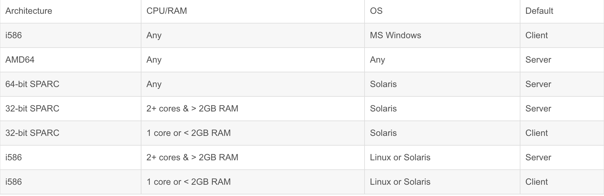
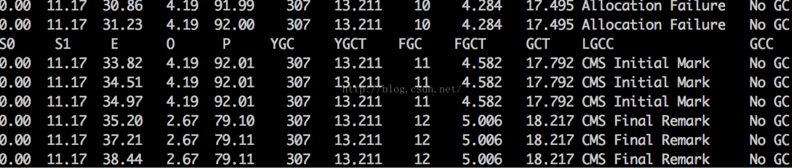
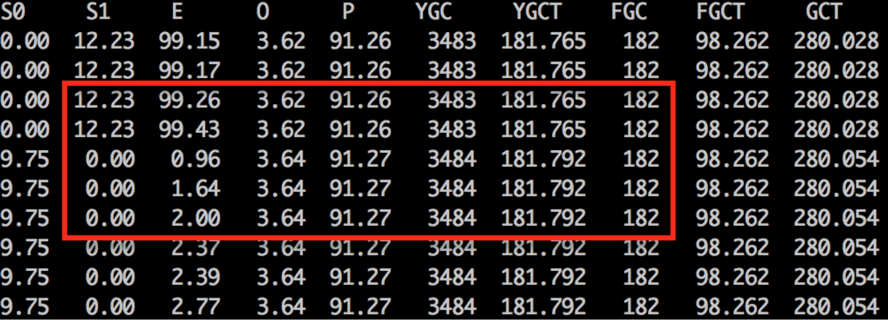

---

layout: single
title: 深入理解Java虚拟机
permalink: java/deep-in-jvm-diary.html

classes: wide

author: Bob Dong

---

# 前言

原文写于2014年，[链接](https://blog.csdn.net/puma_dong/article/details/19751597)。

本篇是《深入理解Java虚拟机-Java 高级特性与最佳实践》学习笔记，周志明著，Understanding the JVM-Advanced Features and Best Practices，机械工业出版社，2011.6出版。

重温Java JVM知识，重点学习了与日常开发工作相关性最大的“自动化内存管理”模块，对Java容器优化、内存问题解决很有帮助；习惯了从互联网看电子书，难以集中和记忆，现在找几本纸质书重温，可以很清静、很安静的理解和消化，受益匪浅。

# 自动内存管理机制

Java和C++之间有一睹由动态内存分配和垃圾收集机制组成的墙，里面的人想出来，外面的人想进去。

Java虚拟机的内存管理与垃圾回收，是虚拟机结构体系中最重要的组成部分，对我们程序的性能和稳定性有着非常大的影响。

## Java内存区域与内存溢出异常

- 堆（Heap）

  - 存储内容：对象实例

    在虚拟机启动时创建，是VM所管理的内存中最大的一块，是垃圾收集器管理的主要区域，也被称作“GC堆”，堆是所有线程共享的

  - 可能发生的溢出错误及优化措施

    OutOfMemoryError: Java heap space，通过调节参数-Xms2048m -Xmx2048m，设置堆的初始内存和最大内存进行优化

- 虚拟机栈（VM Stack)

  - 存储内容：Java方法执行的内存模型：每个方法被执行时，都会同时创建一个栈帧（Stack Frame）用于存储局部变量表（基本数据类型和对象引用类型），操作数栈，动态链接，方法出口等信息

    生命周期和线程相同，每个方法被调用直至完成的过程，就对应着一个栈帧在虚拟机栈中入栈和出栈的过程，有时会通过减小栈和堆大小的方式优化，以保证可以开更多线程,栈是线程私有的

  - 可能发生的溢出错误及优化措施

    单线程可能会报StackOverflowError，多线程可能会报OutOfMemoryError,对应参数是-Xss2m，一般不设这个参数，而是采用默认值

- 本地方法栈（Native Method Stack）

  - 本地方法栈和虚拟机栈所发挥的作用非常相似，其区别是：虚拟机栈为虚拟机执行Java方法（也就是字节码）服务，而本地方法栈为虚拟机使用到的Native方法服务。
  - 在Sun HotSpot虚拟机中，本地方法栈和虚拟机栈是在一起的。

- 方法区（Method Area）

  - 存储内容：类信息、常量、静态变量、即时编译器编译后的代码

    有个别名叫Non-Heap，对于HotSpot来说，也被称作“永久代”（Permanent Generation），运行时常量池（Runtime Constant Pool）是方法区的一部分，方法区是所有线程共享的

  - 可能发生的溢出错误及优化措施

    OutOfMemoryError: PermGen space，通过调节参数-XX:PermSize=1024m -XX:MaxPermSize=1024m，设置方法区的初始内存和最大内存进行优化

- 直接内存（Direct Memory）

  直接内存不是虚拟机运行时数据区的一部分，是使用Native函数库直接分配的堆外内存，然后通过一个存储在Java堆中的DirectByteBuffer对象作为这块内存的引用，目的是在一些场景中显著提高性能，因为避免了再Java对和Native堆中来回复制数据；

  可以通过-XX:MaxDirectMemorySize指定，如果不指定，则默认与Java堆的最大值（-Xmx指定）一样；会报溢出错误:OutOfMemoryError

- 三大商业虚拟机：Sun HotSpot,Bea Jrockit,IBM J9，前两个虚拟机都已经被Oracle收购，Sun HotSpot是使用最普遍的虚拟机。

**JDK5.0以后每个线程栈大小为1M，之前每个线程栈大小为256K。**

应当根据应用的线程所需内存大小进行调整。在相同物理内存下，减小这个值能生成更多的线程。但是操作系统对一个进程内的线程数还是有限制的，不能无限生成，经验值在3000~5000左右。

需要注意的是：当这个值被设置的较大（例如>2MB）时将会在很大程度上降低系统的性能。

如果我们需要知道，JVM虚拟机的默认参数配置，可以使用命令查看：

java -XX:+PrintFlagsInitial | grep Ratio

我们可以看到，新生代和老年代的默认比值是2；Survior和Eden的默认比值是8.

[JVM实用参数（三）打印所有XX参数及值](http://ifeve.com/useful-jvm-flags-part-3-printing-all-xx-flags-and-their-values/)

**补充一个案例，如下：**

如果写了一个普通的死循环，没有发现，则会占用cpu时间，但是可能不会导致内存溢出的情况，因为可能对于堆和栈空间都没有太大影响；

但是如果写了个递归死循环，循环递归，则马上会报StackOverFlow，因为随着递归函数的调用，大量的本地变量被声明，很快，栈空间就满了；

另，对于不同的JDK，可能会变化，比如String的常量String.intern()，在JDK6中存放在“方法区”的“运行时常量池”中，但是在JDK7中，就存放在堆中了，所以，很多细节也是在一直变化中的。。。

参考网址：

http://blog.csdn.net/kthq/article/details/8618052

http://www.open-open.com/lib/view/open1324736648468.html

## 垃圾收集器与内存分配策略

- 对象已死的确定方法

  - 引用计数算法

    使用案例：COM、AS3、Python、Squirrel

    很难解决对象之间的相互循环引用问题

  - 根搜索算法

    Java、C#、Lisp

  在Java语言里，可以作为GC Roots的对象包括：(虚拟机栈中的/方法区中的类静态属性和常量/本地方法栈中JNI)引用的对象

  Java对象的finalize方法，优先级低，运行代价高昂，不确定性大，无法保证各个对象的调用顺序，建议大家完全可以忘记Java中还有这个方法的存在；这个方法最多只会被垃圾收集器调用一次。

- 垃圾收集算法

  - 标记-清除算法

    基础的收集算法，后续的收集算法都是对其缺点改进而得的，主要缺点：效率问题和空间问题

  - 复制算法

    现在的商业虚拟机都采用这种算法来回收新生代，Eden空间+2*Survivor空间，8:1，90%内存利用率。

  - 标记-整理算法

    老年代采用这种收集算法，标记后将所有存活对象向一端移动，然后直接清理掉端边界之外的内存。

  - 分代收集算法

    实际就是对内存分代后，以上几种算法的选择。

- 垃圾收集器（垃圾收集算法是方法论，垃圾收集器是实现）

  - Serial

    新生代使用，单线程，Stop The World，复制算法

  - ParNew

    Serial的多线程版本

  - Parallel Scavenge

    生代使用，并行，多线程，吞吐量优先，适用于在后头运算而不需要太多交互的任务，复制算法

  - CMS

    老年代使用，并发，多线程，Concurrent Mark Sweep，以获取最短回收停顿时间为目标，标记-清除算法，它的问题是会产生内存碎片

  - Serial Old

    老年代使用，单线程，标记-整理算法，主要Client模式使用，如果在Server模式使用，有两大用途：一个是在JDK1.5及之前的版本中与Parallel Scavenge搭配使用；另一个就是作为CMS收集器的后备预案，在Concurrent Mode Failure的时候使用

  - Parallel Old

    Parallel Scavenge的老年代版本，标记-整理算法

  - G1

    Garbage First，收集器技术发展的最前沿成果，标记-整理算法，精确控制停顿时间，极力避免全区域垃圾收集

  并行：Parallel，不论宏观还是微观，都是同时进行的；

  并发：Concurrent，宏观上是同时进行的，微观上不一定是同时进行的，可能是交替执行。

- JDK6默认的垃圾收集器

  - Client模式

    默认-XX:+UseSerialGC，使用Serial+Serial Old的组合进行垃圾回收

  - Server模式

    默认-XX:+UseParallelGC，使用Parallel Scavenge+Parallel Old的组合进行垃圾回收，之前的JVM，可能是Parallel Scavenge+Serail Old，总之，随着版本变迁，可能会有不同

- JVM默认的客户端还是服务器模式，取决于下面的情况

  

-  内存分配策略

  对象优先在Eden分配、大对象直接进入老年代、长期存活的对象将进入老年代、动态对象年龄判定、空间分配担保

  验证了前3条内存分配策略，在Win8.164bit及RHEL6.164bit下，和书中描述规则不一致，原因是我的i5-3210CPU被识别为AMD64，所以是默认以Server方式启动JVM，采用ParallelGC；我在启动JVM时，加上参数-XX:+UseSerialGC，强制使用SerialGC，则案例验证通过

  PretenureSizeThreshold，即设定直接进入老年代的大对象尺寸的参数，只对Serial和ParNew生效；

  也由此可见，内存分配策略具有非常复杂的规则，不仅仅是这几条规则所能描述的。

  **总结：**经过半个世纪的发展，内存的动态分配和回收技术已经相当成熟；但是当需要排查各种内存溢出、内存泄露问题时，当垃圾收集成为系统达到更高并发量的瓶颈时，我们就需要对这些“自动化”的技术实施必要的监控和调节。

- 查看JVM进程使用的垃圾回收器

  jinfo -flag UseSerialGC 60282

  jinfo -flag UseParNewGC 60282

  jinfo -flag UseParallelGC 60282

  jinfo -flag UseParallelOldGC 60282

  jinfo -flag UseConcMarkSweepGC 60282

- jstat -gccause -h10 pid 2000

  查看GC情况。

  

  http://phl.iteye.com/blog/2004211

  参考文章：

  http://jeromecen1021.blog.163.com/blog/static/18851527120117274624888/

  http://blog.csdn.net/gugemichael/article/details/9345803  讲GC的，S0、S1为什么总有一个是空的

  http://www.fasterj.com/articles/oraclecollectors1.shtml

  http://blog.csdn.net/dc_726/article/details/7934101

  http://jbutton.iteye.com/blog/1569746

## 内存性能分析与故障处理工具

- jps

  JVM Process Status Tool，显示指定系统内所有的HotSpot虚拟机进程

  -q: 只输出LVMID，省略主类的名称

  -m: 输出虚拟机进程启动时传递给主类main()函数的参数

  -l: 输出主类的全名，如果进程执行的是Jar包，输出Jar路径

  -v: 输出虚拟机进程启动时JVM参数

- jstat	

  JVM Statistics Monitoring Tool，用于收集HotSpot虚拟机各方面的运行数据

  -class: 监视类装载，卸载数量，总空间及类装载所耗费的时间

  -gc: 监视Java堆状况，包括Eden区，2个survivor区，老年代，永久代等的容量，已用空间，GC时间合计等信息

  -gccapacity: 监视内容与-gc基本相同，但输出主要关注Java堆各个区域使用到的最大和最小空间

  -gcutil: 监视内容与-gc基本相同，单输出主要关注已使用空间占总空间的百分比

  -gccause: 与-gcutil功能一样，但是会额外输出导致上一次GC产生的原因

  -gcnew: 监视新生代GC的状况

  -gcnewcapacity: 监视内容与-gcnew基本相同，输出主要关注使用到的最大和最小空间

  -gcold: 监视老年代GC的状况

  -gcoldcapacity: 监视内容与-gcold基本相同，输出主要关注使用到的最大和最小空间

  -gcpermcapacity: 监视永久代使用到的最大和最小空间

  -compiler: 输出JIT编译器编译过的方法，耗时等信息

  -printcompilation: 输出已经被JIT编译的方法

- jinfo

  Configuration Info for Java，显示虚拟机配置信息

  -flag: jinfo -flag MaxPermSize 进程ID号，显示参数值

  -sysprops: 把虚拟机进程的System.getProperties()的内容打印出来

- jmap

  Memory Map for Java，生成虚拟机的内存转储快照（heapdump文件）

  -dump: 生成Java堆转储快照。

  格式为:-dump:[live,]format=b,file=<filename>，其中live子参数说明是否只dummp出存活的对象

  -finalizerinfo: 显示在F-Queue中等待Finalizer线程执行finalize方法的对象。只在linux/Solaris平台下有效

  -heap: 显示Java堆详细信息，如使用哪种回收器，参数设置，分代状况等。只在linux/Solaris平台下有效

  -histo: 显示堆中对象统计信息，包括类、实例数量和合计容量

  -permstat: 以ClassLoader为统计口径显示永久代内存状态。只在linux/Solaris平台下有效

  -F: 当虚拟机进程对-dump选择没有响应时，可使用这个选项强制生成dump快照。只在linux/Solaris平台下有效

- jhat

  JVM Heap Dump Browser，用于分析headdump文件，它会建立一个HTTP/HTML服务器，让用户可以在浏览器上查看分析结果

  实际生产中，没有人会这么来分析headdump文件

- jstack

  Stack Trace for Java，显示虚拟机的线程快照

  -F: 当正常输出的请求不被响应时，强制输出线程堆栈

  -l: 除堆栈外，显示关于锁的附加信息

  -m: 如果调用到本地方法的话，可以显示C/C++的堆栈

  ```
  jstack  -l -F 15348 >> 169.txt 
  sudo -u root /usr/java/jdk1.6.0_26/bin/jstack -F 15348
  ```

  在JDK6U23之前，执行jstack,jmap -F会有Bug，看这个文章：http://developer.51cto.com/art/201203/321359.htm

  jstat -gcutil -h10 pid 1000

  GC的时间单位是：second

  

- MAT

  除了以上之外，另外推荐一个内存分析工具，下载地址：http://www.eclipse.org/mat/downloads.php，它分析的是JVM内存的dump文件，此文件可以通过jmap -dump:format=b,file=xxx.bin pid将内存dump出来，也可以通过设置-XX:+HeapDumpOnOutOfMemoryError参数，在JVM出现OOM时自动输出到文件；或者在VisualVM中直接对监控的JVM进程单击右键，选择“Heap Dump”，将JVM的内存dump出来。

- BTrace

  下载地址：https://kenai.com/projects/btrace/downloads/directory/releases

  写一段脚本，随时切入正在运行的程序，跟踪代码的调用。写一段Btrace脚本还是很麻烦的，不详述了。

  其他的工具还有：HSDB，Java自带的，执行方式如下：

  java -classpath .:$JAVA_HOME/lib/sa-jdi.jar sun.jvm.hotspot.CLHSDB

- jvisualvm

  可以远程监控Java进程，比如Tomcat，增加启动参数：

  ```
  JAVA_OPTS="-Dcom.sun.management.jmxremote.port=9998 -Dcom.sun.management.jmxremote.ssl=false -Dcom.sun.management.jmxremote.authenticate=false -Djava.rmi.server.hostname=10.10.10.212"
  ```

  或者java进程，启动时增加参数，比如：

  ```
  java -Xms2048m -Xmx46080m -classpath $CLASSPATH -Dcom.sun.management.jmxremote.port=9998 -Dcom.sun.management.jmxremote.ssl=false -Dcom.sun.management.jmxremote.authenticate=false -Djava.rmi.server.hostname=10.10.10.212 com.yougou.recommend.service.ViewViewServiceReverse >> "$stats_log"
  ```

  则可以在本地通过jvisualvm监控进程情况，在命令行输入jvisualvm，远程，连接ip地址，之后右键这个远程连接，新建JMX连接，输入端口，则可以监控这个远程java进程了。

# 调优案例分析与实战

## 高性能硬件上的程序部署策略

**案例：**

场景：在线文档网站，硬件升级(CPU变为4个，内存变为16G)，出现十几分钟停顿十几秒现象

原因：文档序列化产生大量大对象，进入老年代，导致没有在Minor GC清理掉，Full GC耗时导致的停顿现象

解决：硬件分成5个虚拟机，做成集群，用前端负载；结果速度比硬件升级前有较大提升，也不再停顿

**两种方式：**

在高性能硬件上部署程序，主要有两种方式：

1.通过64位JDK来使用大内存

2.实用若干个32位虚拟机建立逻辑集群来利用硬件资源

**结论：**

控制Full GC频率的关键是看应用中绝大多数对象能否符合“朝生夕灭”的原则，即大多数对象的生存时间不应当太长，尤其不能产生成批量的、长生存时间的大对象，这样才能保障老年代空间的稳定；

在大多数网站形式的应用中，主要对象的生存周期都应该是请求级或页面级的，会话级和全局级的长生命对象相对较少。

只要代码合理，应当都能实现在超大堆中正常使用而没有Full GC，这样的话，使用超大堆内存时，网站响应速度才比较有保障。

## 集群间同步导致的内存溢出

**案例：**

场景：6个节点的WebLogic集群，有数据在各个节点间共享，开始存在数据库中，后来改为JbossCache全局缓存

原因：既有JBossCache的缺陷，也有实现方式的缺陷，集群间频繁的写操作，当网络情况不能满足传输要求时，重发数据在内存中不断的堆积，很快就产生了内存溢出

**结论：**

对于部分数据在各个节点共享的场景，使用更为成熟的第三方框架，比如Redis

## 堆外内存导致的溢出错误

**案例：**

场景：2G内存，1G堆内存，发生内存溢出，对内存调大为1.6G，溢出反而更频繁了

解决步骤：利用jstat，发现GC正常，Eden区、Survivor区、老年代、永久代均正常，在内存溢出后从系统日志中找到异常对照，有java.nio.ByteBuffer.allocateDirect

原因：案例使用的CometD1.1.1框架，有大量的NIO操作需要用到DirectMemory

**结论：**

Direct Memory:可通过-XX:MaxDirectMemorySize调整大小，内存不足时抛出OutOfMemoryError或OutOfMemoryError:Direct buffer Memory；

线程堆栈：可通过-Xss调整大小，内存不足时抛出StackOverFlowError（纵向无法分配，即无法分配新的栈帧）或OutOfMemoryError:unable to create native thread（横向无法分配，及无法建立新的线程）；

Socket缓存区：每个Socket连接都有Receive和Send两个缓存区，分别占大约37KB和25KB的内存，连接多的话这块内存占用也比较可观。如果无法分配，则可能抛出IOException:Too many open files异常；

JNI代码：如果代码中使用JNI调用本地代码库，那本地代码库使用的内存也不在堆中；

虚拟机和GC:虚拟机和GC的代码执行也要消耗一定的内存。

## 外部命令导致系统缓慢

**案例：**

场景：大并发压力下，请求缓慢，通过监控，发现CPU使用率很高，并且CPU占用不是程序本身，通常情况下，用户应用的CPU占用应该占主要地位。

解决步骤：通过开发人员找到答案，每个用户请求，时都要执行一个外部Shell获得系统的一些信息。这些Shell脚本是通过Java的Runtime.getRuntime().exec()方法调用的。Java虚拟机执行这个命令的过程是：首先克隆一个和当前虚拟机拥有一样环境变量的进程，再用这个新的进程执行外部命令，最后再退出这个进程。如果频繁执行这个操作，系统的消耗会很大，不仅是CPU，内存的负担也很重。

解决：去掉这个shell脚本的执行，改用Java的API去获取这些信息。

## 服务器JVM进程崩溃

**案例：**

场景；第二个案例的配置，频繁出现集群节点的虚拟机进程自动关闭的现象。
找出问题：有异常日志，java.net.SocketException:Connection reset，这是一个远程断开连接的异常，通过系统管理员了解到最近和第三方远程OA做过对接。经过测试，发现调用远程WebService长达3分钟才返回，并且返回的结果都是连接中断。

原因：由于系统经常调用远程服务，但是两边服务的速度完全不对等 ，时间越长就累积越多的服务没有调用完，导致在等待的线程和Socket连接越来越多，最终超过虚拟机的承受能力后使得虚拟机的进程崩溃。

**结论：**

及时验证接口服务，尽量在允许的情况下，采用异步消息机制，比如RabbitMQ之类。

# 虚拟机执行系统：类加载、编译和执行

这一部分深入讲解了虚拟机的执行过程，对实际工作中的帮助相对较小，这里只记录下篇章，及一些领悟，不做深入学习。

篇章：《类文件结构》、《虚拟机类加载机制》、《虚拟机字节码执行引擎》、《类加载及执行子系统的案例与实战》、《编译器优化》、《运行期优化》

这些篇章介绍了Class文件格式、类加载及迅疾执行引擎，这些内容是虚拟机中必不可少的部分，了解了虚拟机如何执行程序，才能更好地理解怎样才能写出优秀的代码。

代码编译的结果从本地机器码变为字节码，是存储格式发展的一小步，却是编程语言发展的一大步。

Java语言规范和Java虚拟机规范是分别定义的，这说明任何语言，编译成的字节码只要符合Java虚拟机规范，都可以在Java虚拟机执行，当前这样的语言有：Clojure,Groovy,JRuby,Jython。

Java程序从源码编译成字节码和从字节码编译成本地机器码的过程，Javac字节码编译器与虚拟机内的JIT编译器的执行过程合并起来，其实就等于一个传统的编译器所执行的编译过程。

对Java编译器的深入了解，有助于在工作中分辨哪些代码是编译器可以帮我们处理的，哪些代码需要自己调节以便更适合编译器的优化。

# 高效并发

并发处理的广泛应用是使得Amdahl定律代替摩尔定律成为计算机性能发展源动力的根本原因，也是人类压榨计算机运算能力最有力的武器。

volatile修饰符，当一个变量被定义为volatile后，则此变量对多有线程可见，即新值修改了值后，其他线程立即得知；但是这种类型不是原子性的， 依然做不到线程安全，书中有实例。

immutable的 对象一定是线程安全的，比如String对象。

绝对线程安全的对象几乎没有，书中演示了Vector对象多线程移除，get时获取不到的情况，依然需要对vector对象加锁才保证了正确的结果。Java API中，绝大多数的线程安全类，都是相对线程安全的。

suspend，resume，setIn，setOut，runFinalizersOnExit等有死锁风险，被废弃。

线程安全最常用的实现，就是互斥同步，是阻塞的，利用synchronized。

本书的后面部分，关于虚拟机执行系统的，关于编译优化的，关于高效并发的，和实际编码、架构等技术性工作的相关性相对较低，不进行进一步的深入学习。

# 内存溢出代码示例

## HeapSize OOM -- Java heap space

```java

class HeapOOM {
        public static void main(String[] args) {
                java.util.List<String> list = new java.util.ArrayList<String>();
                while(true) {
                        list.add("内存溢出啊，内粗溢出啊！");
                }
        }
}

# 执行java -Xmx2m HeapOOM，堆内存瞬间溢出，报错：java.lang.OutOfMemoryError:Java heap space
```

## HeapSize OOM -- GC over head limit exceeded

```
import java.util.*;
class GCOverHead {
        public final static byte[] DEFAULT_BYTES = new byte[12*1024*1024];
        public static void main(String[] args) {
                List<byte[]> temp = new ArrayList<byte[]>();
                while(true) {
                        temp.add(new byte[1024*1024]);
                        if(temp.size()>3) {
                                temp.clear();
                        }
                }
        }
}
```

执行java -XX:+PrintGCDetails -XX:+UseGCOverheadLimit -Xmn5m -Xmx20m GCOverHead ，据说会报java.lang.OutOfMemoryError:GC over head limit exceeded，意思是不断在做Full GC，每次GC完后释放一点点内存，然后一下子就又满了，不断重复，当次数达到一定量，并且平均FULL GC时间达到一定比例时，就会报错；

但是，我的程序一直就无限循环运行，不报错误.

## PermGen OOM

```
import net.sf.cglib.proxy.Enhancer;
class ClassPermGenOOM {
        public static void main(String[] args) {
                while(true) {
                        createProxy(ClassPermGenOOM.class);
                }
        }
        public static Object createProxy(Class<?> targetClass) {
                Enhancer enhancer = new Enhancer();
                enhancer.setSuperclass(targetClass);
                enhancer.setUseCache(false);
                enhancer.setCallback(new MethodInterceptor() {
                        public Object intercept(Object object,
                                Method method,Object[] args,
                                MethodProxy methodProxy) throws Throwable {
                                return methodProxy.invokeSuper(object,args);
                        }       
                });
                return enhancer.create();
        }
}

# 执行java -XX:+TraceClassUnloading -XX:PermSize=10m -XX:MaxPermSize=10 ClassPermGenOOM，会报出java.lang.OutOfMemoryError:PermGen space错误。
```

## DirectBuffer OOM

```

import java.nio.ByteBuffer;
class ByteBufferOOM {
        public static void main(String[] args) {
                ByteBuffer.allocateDirect(257*1024*1024);
        }
}

# 执行java -XX:MaxDirectMemorySize=256m ByteBufferOOM，则会报出错误java.lang.OutOfMemoryError:Direct bufer memory。
```

## StackOverflowError

栈溢出，无限递归即可。

死递归和死循环不一样，死循环时，栈空间不会递增；而死递归由于需要记录退回的路径，就必须记住递归过程中的方法调用过程，以及每个方法运行过程中的本地变量，这个我们称之为上下文信息，随着内容的增加，就会占用更多的内存空间，JVM是为了控制它的无限制增长，才做了安全检测的处理。

# 后记

