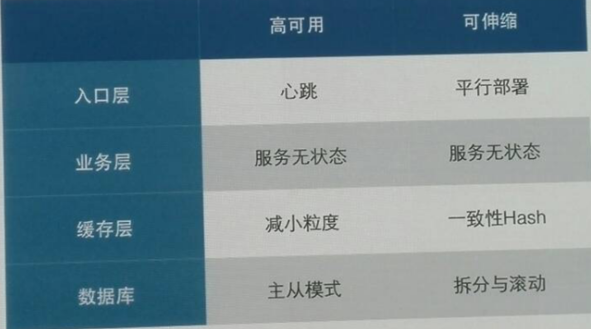

---

layout: single
title: Java学习（设计模式）
permalink: /java/design-pattern.html

classes: wide

author: Bob Dong

---

# 前言

设计模式，先看名字，设计，模式，目的是为了设计，为了设计给出一些定义出来的，总结出来的，抽象出来的办法，叫做模式。

设计是什么？软件构建中的设计，承前（需求分析、产品定义、架构选择），启后或者伴随（编码、测试），包含结构、包、类、子程序，而模式讲的就是这些东西。

设计模式是一种思想

这次关于设计模式的分享不是纯技术，是思想。

思想的东西，很难讲，需要听众具备恰当的理解层次，而这种层次的进化，远比一种技术或者工具的进步难以捉摸，有时十年循环不如一夕顿悟。

设计模式是一种思想，是与语言强相关的。

在低级语言（机器、汇编）中，不会有模式；在未来的高级语言中，会从语法层面实现模式（模式本身是语义层面的）；在当前广泛使用的高级语言（Java）中，模式被基于解决特定场景的问题，抽取出来，大行其道，广泛使用。

低级语言和高级语言，没有一条分界线，是逐渐进化的。每个程序员都处于其所在的层次上（或者叫境界），处于一个层次，能理解低层次的落后（比如机器语言），但无法理解高层次的先进。这就是《黑客与画家》中所说的Blub困境。

引申到职场、人生和世界观，每个人也都活在自己的抽象层次中，能看懂低层次的落后，但无法理解高层次先进在何处。从境界高低来讲，是有对错的，但如果没有进化到一个层次，也是无法从根本上被说服的，需要到达，才能认知。

面向对象的三大特征

面向对象三大特性：封装、继承、多态。

封装，往往和抽象、高内聚、一致的抽象层次等概念联系在一起。

继承是一条竖线，在编程中很常用，但更常用的是包含（"has a"），从广义上来说，甚至可以认为"has a"，也是一种适配器模式。能用包含，则不用继承，因为继承引入了继承体系上的复杂性。

多态是继承基础上的重写，加上父类变量对子类对象的引用。可以认为多态，是Java这种静态类型语言，向动态类型语言（比如ruby/python），迈出的一小步。

抽象：

抽取事物最本质形成概念。

并运用概念进行推理、判断的思维活动。

抽象交流。

模拟能力,想象能力。

表达能力(口头,文字,文言文和琼瑶剧)。

字、词、句、段.

单例

单例是最重要的一种设计模式。是无状态的逻辑。无状态是业务层实现高可用和可伸缩的重要手段。

单例一：基础

演示了一个最简单的单例、延迟初始化的单例，以及双重检查机制的单例的代码写法。

对于双重检查机制的单例，减小了线程间的碰撞（synchronized），只有前几个线程才可能碰撞，锁的力度小了，性能提高了，线程也安全了。

对于双重检查单例，没有实际意义，只有历史意义，增加Java程序员对于所犯错误的洞察力，如果写单例，有最简单的写法就够了。

过去陈旧的JDBC操作数据库编码过程中，有代码Class.forName("com.mysql.jdbc.Driver")，目的是把类装载到JVM的PermGen区域，这样类的静态方法就可以使用了，这和类的初始化没关系。

显式API初始化也有好处，比如web系统，init写到监听里面去。把初始化放到init里面。清晰了。

单例二：Spring

Java生态中，除了JDK之外，最基础的框架是Spring。Spring框架的高层抽象很多，帮我们解决了很多场景下的技术问题。

Spring的基础的、底层的思想是控制反转（Invest Of Control）、依赖注入（Dependency Injection），可以认为是单例的一种表现形式。说的是两个单例对象之间的关系。

控制反转，反转的控制权，原来是谁用谁有控制权；控制反转的思想是，你可以用，但是我依然有初始化自己的控制权。

依赖注入，谁要用（就是谁依赖），谁负责把别的类引入进来。

写简简单单的3个类，能解释Spring的思想。读取配置文件或者扫描Spring注解，利用反射实例化类，放置到一个Map中，这就是Spring IOC的基础过程了。

结合《Spring技术内幕：深入解析Spring架构与设计原理》，花费1个星期简要看看Spring源码，发现就是这样的。

单例三：状态和线程安全

参考文章：http://www.iteye.com/topic/960532

有状态：有状态就是有数据存储功能。

无状态：无状态的都是功能操作，对象是线程安全的。

几个概念：维护全局状态、控制状态读写、线程安全。

以上指的是状态的线程安全。对于HashMap的解释，如果从状态的线程安全绝度解释，也是说的通的，HashMap里面有数组，也是有状态的。

单例四：数据库

状态固化的单例：其实就是数据库，每一行可以看作一个单例，它是系统唯一的，也可以是线程安全的。

跨JVM的单例：实现方式有很多，只要满足有锁的持久化即可。

多进程安全的单例：说的是数据库锁。

以上都是分布式的思想。

自从有了数据库，程序员就变得廉价了。

其他的创建模式

工厂、抽象工厂、建造者、原型。

工厂：创建对象很复杂，所以需要一个创建对象的工厂。

建造者：比如耐克工厂，有鞋帮，有鞋带，合起来之后是一个完整的整体，这就是建造者模式。

什么时候用单例，什么时候用单一状态（类的单一状态）。

为什么不全部用static，而用单例？有一种解释是：控制反转、依赖注入，这种思想。保留了初始化自己的控制权。如果完全的工具类，没有初始化的需求，static就满足了。

结构模式

开闭原则：对修改封闭，对扩展开放。

包装（Composite）：不想改变原代码，又想实现某些功能。

代理（Proxy）：举了一个监护人的例子，让吃才能吃。不改变语义，前前后后做点东西出来。

适配（Adapter）：adapter比proxy更牛逼一些，它改变了语义，些许进行改造。

外观（Facade）：和代理先比，结构相似，语义不同。

继承是标签，接口表现了具备什么能力。

面向对象一直争论的问题：

是用包含（用你的能力，但不打你的标签，"has a"），还是用继承（"is a"）。一种观点认为，继承对于软件设计，引入了复杂性。

行为模式

行为模式，描述的是对象的动作。局限性，必须顺序执行。？？？

模板：高层的流程抽象。

责任链：演示一个通过注解定义执行顺序的历程。好处：1.动态的组织流程；2. 代码控制流程的执行；深化一下，就是工作流。

以上两种模式，是重构的利器，加上反射，就可以写通用功能的中间件了。

不是结束

设计模式是很枯燥的，记住三件事：创建一个对象、包装一个对象、根据当前的场景，信手拈来。

农夫山泉：我们不生产水，我们只是大自然的搬运工。程序员不能成为农夫山泉，不能只是jar包的搬运工。要学会创造，一边搬砖的时候，一边想一想，如何创造出更优秀的东西。

单例/静态、线程安全、无状态，是从3个维度对软件问题的描述，单例/静态是思想角度（单例是设计模式，是语义层面的思想，静态是编程语言从语法角度固化的思想），线程安全是技法角度（是一种基于现代的硬件基础的、常见的、需要解决的，重要的问题场景），无状态是数据角度（无状态的类，实际就是不具备数据存储能力的类）。

大师的话（linus)

烂程序员关心的是代码。好程序员关心的是数据结构和它们之间的关系。

面向对象语言以对象为核心，加一些相关联的方法，简直是呓语。

重要的东西应该是数据结构，对象本身有啥重要？

真正有意思的，是在不同类型的不同对象交互而且有锁规则的时候。

但是，即使是这时候，封装什么“对象接口”也绝对错误，因为不再是单一对象的问题了。

他的结论是，面向对象解决的都是一些小问题。

这位大师是写操作系统的，从他的角度来看，自然是正确的，即使不从他的角度，我们也可以认识到数据结构的重要性。

# 后记

