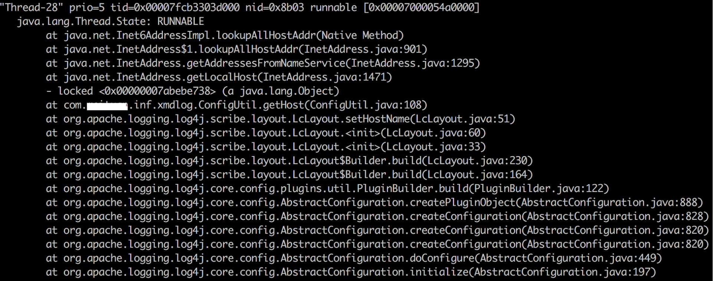
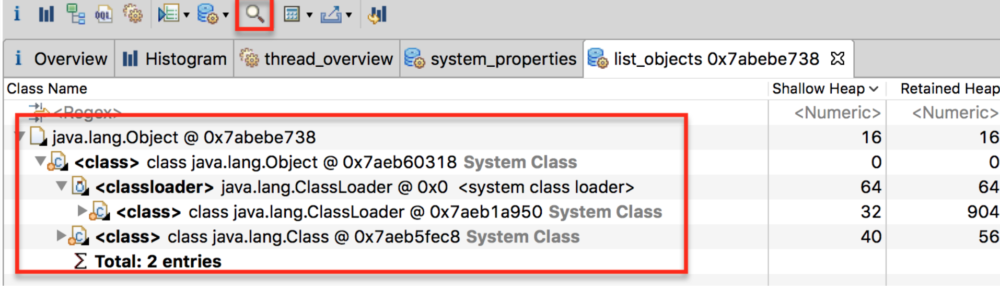
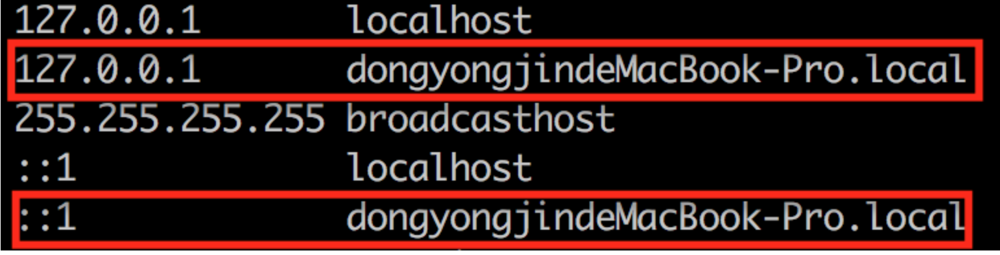

---

layout: single
title: Case Study（Java类InetAddress.getLocalHost()中的坑）
permalink: java/get-local-host.html

classes: wide

author: Bob Dong

---

起因

某一天，项目启动突然很慢，并且连很简单的单元测试都需要1分钟的时间才开始运行；貌似是Mac升级到最新版本的：Sierra之后开始出现的。

分析

jstack

jstack -l pid | more，看到每次项目都会在这个地方锁住，锁大约1分钟

### jmap

jmap -dump:format=b,file=xx pid，用MAT分析，可以看到这个地址就是一个简单的Object对象，没啥特别

debug

debug工程，发现 java.net.InetAddress.getLocalHost 每次都会锁5秒，很多jar都会调用到这个方法，累计就让启动启动停滞了1分钟。

具体的阻塞点是：addresses = nameService.lookupAllHostAddr(host);

初步解决

修改/etc/hosts，增加两行，IP地址到 hostname 对应的主机名的映射，OK了。

原文链接：https://blog.csdn.net/puma_dong/article/details/53096149

## 机器发生了什么

这个InetAddress.getLocalHost()是Java原生方法的坑，之前我也没碰到过，这个方法会通过内核指令获取本机host，所以如果本机hosts配置被改动过的话，再需要经过DNS解析本机ip的话，获取会很慢。

<https://www.cnblogs.com/jizhao/p/4081675.html>