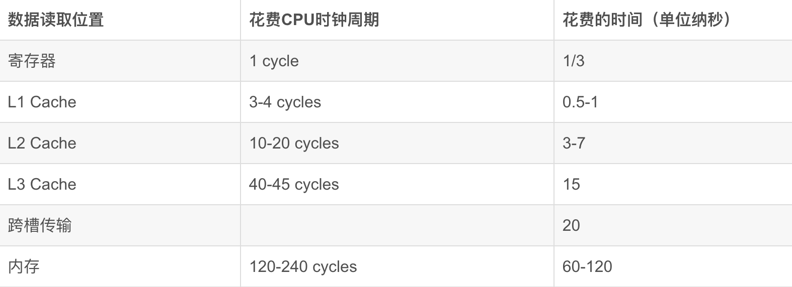
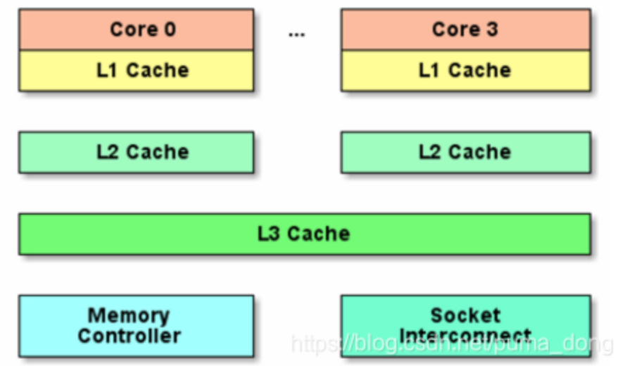
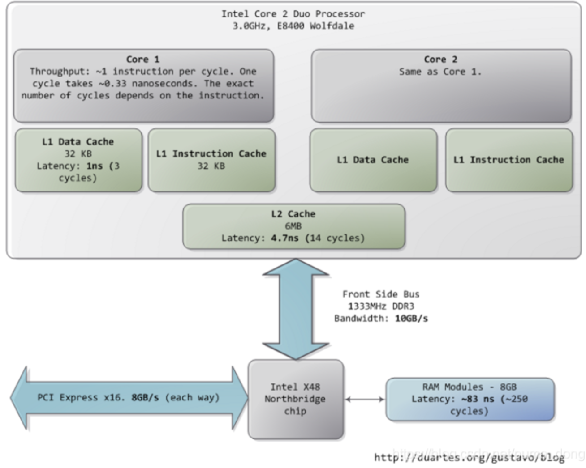
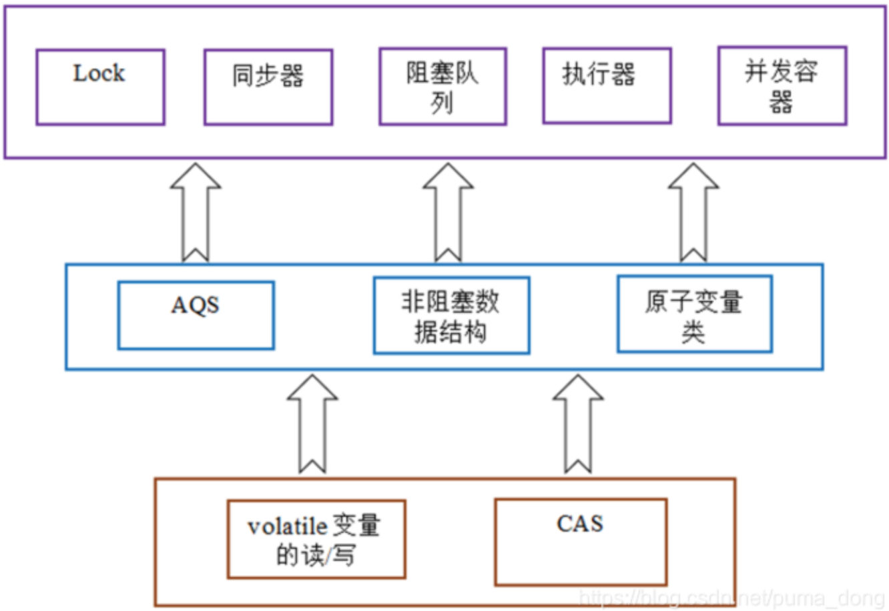

---

layout: single
title: Linux&java进阶（硬件和并发）
permalink: /java/hardware-and-concurrency.html

classes: wide

author: Bob Dong

---

# 前言

从最底层，从硬件级别，了解Java并发的本质。

为什么会有Java并发？为什么我们需要Java并发？

这实际是由于计算机硬件发展的不平衡引起的，CPU发展的极快，而周边硬件发展慢，我们需要把CPU的资源尽可能的利用起来，同时让我们的程序跑的更快。

如果CPU周边的硬件都极快，不论是数据在哪里，CPU拿到数据都没有成本，则并发将毫无意义。

这是一篇2015年个人总结的老文章，个人感觉还不错，分享出来～

# 现代计算机

先讲一下现代计算机（2015年之前）的发展现状，架构的解决方案、语言的低级特性，本质上是基于硬件的当前现状产生的。

## 计算


现代计算机中，已经不追求CPU的时钟频率更高，而是朝着多核的方向发展。因为CPU已经快得离谱，追求更快对于日常应用意义不大，故而更追求多核、并行计算。

在Core 2 3.0 GHz上，大部分简单指令的执行只需要一个时钟周期，也就是1/3纳秒。也就是说，一秒的实际，CPU可以执行30亿次指令，所以我们的定时任务，定到秒级别，定到毫秒级别，CPU都能准时执行，它的调度器完全可以保证。

来自互联网的数据：






**参考文章：**

<http://duartes.org/gustavo/blog/post/what-your-computer-does-while-you-wait/>

## 速度

对于速度，有个形象的比喻，如果，我们把CPU的一个时钟周期看作一秒，则：

从L1 cache读取信息就好像是拿起桌上的一张草稿纸（3秒）；

从L2 cache读取信息就好像是从身边的书架上取出一本书（14秒）；

从主存中读取信息则相当于走到办公楼下去买个零食（4分钟）；

硬盘寻道的时间相当于离开办公大楼并开始长达一年零三个月的环球旅行。

 

前不久的一个场景测试：

5M Excel，大约有50万数据，记录入MySQL数据库，大约花费1分多钟；记入Redis，大约花费10秒，并且在Redis中只占用2M空间，读写1万次，平均实际大约1~5毫秒。

这是真实的案例反映的数据差别。

所以提高程序性能，最低成本，而又最有效的方式就是使用缓存。

## 缓存

缓存无处不在，不论是硬盘、网卡、显卡、Raid卡、HBA卡，都有缓存；缓存是比较容易的解决性能问题的简单方案，非常奏效，非常管用。

通过一级一级的缓存，来增加速度，比如：

CPU的L1只有512K，L2是2M，L3只有好的服务器才有，是18M，L3很贵；

硬盘的缓存，一般只有64M，通过这个64M的缓存来增加速度。

 

引申一个硬盘的问题：

如果掉电了呢？

服务器硬盘，可以通过硬盘内部电池保证缓存内容可以写到盘片上去，而家用计算机硬盘是做不到的，这也是价格差别很大的原因之一。

扩展一下，EMS磁盘阵列，做的很好，很快，是通过多磁头技术，减轻某一个磁盘的压力，内部也有缓存。

 

关于Cache，在架构设计时，经常要解决的一个问题就是：读和写的不安全感。写的时候要保证持久化设备和Cache都写了，读的时候，只读Cache。而服务器端的设备，比如上面说的服务器硬盘，这些问题都是考虑到了的。

## CAS

CAS，Campare And Swap，所有的现代CPU都支持。也是各种语言中，无锁算法，无锁并发实现的根基。也是Java里面的原子类、并发把利用的原理。

这是CPU硬件级别的，OS也不知道，所以这种实现方式能带来性能上的一定提升，也有副作用。

CAS提供了在资源竞争较少情况下更佳的性能，换句话说，当许多线程都想访问共享资源时，JVM 可以花更少的时候来调度线程，把更多时间用在执行线程上。

这篇文章关于CAS说的不错：https://www.jb51.net/article/86192.htm

但是，这是给高级用户准备的，慎用，只有当深切了解确实是需要的场景时，才可用。

代码演示：

```
package com.cl.roadshow.java.util.concurrent;

import java.lang.reflect.Field;
import java.util.HashMap;
import java.util.Map;
import java.util.concurrent.CountDownLatch;
import java.util.concurrent.atomic.AtomicInteger;
import java.util.concurrent.locks.Lock;
import java.util.concurrent.locks.ReentrantLock;

import sun.misc.Unsafe;

/**
 * 演示Java并发的几种实现方法，演示CAS算法的原理
 *
 */
@SuppressWarnings("restriction")
public class CompareAndSwapDemo {

	private static int factorialUnSafe;
	private static int factorialSafe;
	private static int factorialCas;
	private static long factorialCasOffset;
	private static AtomicInteger factorialAtomic = new AtomicInteger(0);
	private static int factorialReentrantLock = 0;
	private static Lock reentrantLock = new ReentrantLock();

	private static int SIZE = 200;
	private static CountDownLatch latch = new CountDownLatch(SIZE * 5);

	private static Object lock = new Object();
	private static Unsafe unsafe;

	// 获取CasTest的静态Field的内存偏移量
	static {
		try {

			Field field = Unsafe.class.getDeclaredField("theUnsafe");
			field.setAccessible(true);
			unsafe = (Unsafe) field.get(null);
			factorialCasOffset = unsafe.staticFieldOffset(CompareAndSwapDemo.class.getDeclaredField("factorialCas"));
		} catch (Exception e) {
			e.printStackTrace();
		}
	}

	/**
	 * 存储每种计算方法的最终结果
	 */
	private static Map<String, Integer> factorialMax = new HashMap<String, Integer>();

	public static void main(String[] args) throws Exception {

		for (int i = 0; i < SIZE; i++) {
			new Thread(new IncreamUnSafe()).start();
			new Thread(new IncreamSafe()).start();
			new Thread(new IncreamCas()).start();
			new Thread(new IncreamAtomic()).start();
			new Thread(new IncreamReentrantLock()).start();
		}

		latch.await();
		System.out.println("IncreamUnsafe Result：" + factorialMax.get("unsafe"));
		System.out.println("IncreamSafe Result：" + factorialMax.get("safe"));
		System.out.println("IncreamCas Result：" + factorialMax.get("cas"));
		System.out.println("IncreamAtomic Result：" + factorialMax.get("atomic"));
		System.out.println("IncreamReentrantLock Result：" + factorialMax.get("reentrant"));
	}

	/**
	 * 非线程安全的
	 *
	 */
	static class IncreamUnSafe implements Runnable {

		@Override
		public void run() {
			for (int j = 0; j < 1000; j++) {
				factorialUnSafe++;
			}
			recordMax("unsafe", factorialUnSafe);
			latch.countDown();
		}
	}

	/**
	 * 线程安全的
	 *
	 */
	static class IncreamSafe implements Runnable {

		@Override
		public void run() {
			synchronized (lock) {
				for (int j = 0; j < 1000; j++) {
					factorialSafe++;
				}
			}
			recordMax("safe", factorialSafe);
			latch.countDown();
		}
	}

	/**
	 * 用CAS算法实现的线程安全的，Java的原子类就是这么搞的，死循环，就是疯狂的压榨CPU
	 *
	 */
	static class IncreamCas implements Runnable {

		@Override
		public void run() {
			for (int j = 0; j < 1000; j++) {
				for (;;) {
					int current = factorialCas;
					int next = factorialCas + 1;
					if (unsafe.compareAndSwapInt(CompareAndSwapDemo.class, factorialCasOffset, current, next)) {
						break;
					}
				}
			}
			recordMax("cas", factorialCas);
			latch.countDown();
		}
	}

	/**
	 * 用原子类实现的线程安全的
	 *
	 */
	static class IncreamAtomic implements Runnable {
		@Override
		public void run() {
			for (int j = 0; j < 1000; j++) {
				factorialAtomic.incrementAndGet();
			}
			recordMax("atomic", factorialAtomic.get());
			latch.countDown();
		}
	}

	/**
	 * 用实现了CAS算法的ReentrantLock实现的线程安全的
	 *
	 */
	static class IncreamReentrantLock implements Runnable {
		@Override
		public void run() {
			for (int j = 0; j < 1000; j++) {
				reentrantLock.lock();
				factorialReentrantLock++;
				reentrantLock.unlock();
			}
			recordMax("reentrant", factorialReentrantLock);
			latch.countDown();
		}
	}

	/**
	 * 记录每个线程的最终结果
	 * 
	 * @param key
	 * @param target
	 */
	static synchronized void recordMax(String key, int target) {
		Integer value = factorialMax.get(key);
		if ((value == null) || (value < target)) {
			factorialMax.put(key, target);
		}
	}
}
```


4.16KB

java并发包的一张图：



java并发的本质表现：

互斥和协作；

互斥，就是常说的线程安全，串行（或者说同步）的执行代码；

协作，指的是线程间的通信和协作，一切协作相关的高级类（工具类），最后都是通过Object里面的wait/notify这两个native方法实现的。

参考文章：

[JDK 5.0 中更灵活、更具可伸缩性的锁定机制](http://www.ibm.com/developerworks/cn/java/j-jtp10264/index.html)

# 总结

为什么AtomicInteger的实现中，用死循环？原因是因为CPU太快了。其他一些概念，比如“自旋锁”，也是这个道理。

性能写到极致，是可以用上L1、L2，Java程序员是做不到了，离底层太远。应用场景中，最大的性能瓶颈，往往都是数据库，而不是程序。如果问题出在程序，则基本都是程序的Bug，而不是程序没有优化到极致。比如：曾经遇到一个CPU Load逐渐到达几百的场景，而最终的答案，是特殊情况下的线程死循环。

CPU为了提高速度，加了很多Cache，这对我们写好程序也有影响。如果是一个CPU，就不会存在线程安全问题了吗？依然会的，CPU调度的时候，依然可能在3条指令之间中断。

volatile关键字，屏蔽了L1、L2，让变量的结果之间写到内存，写的时候锁总线，所以其他线程读到的一定是最新的结果，实现了读线程安全。参考文章：聊聊并发（一）——深入分析Volatile的实现原理。

ThreadLocal，这个类在Java语言中，紧紧跟随着线程，存储线程本身的变量，非常像CPU的L1、L2。

既然CPU那么快，为什么CPU还会经常负载报警呢？抛开应用层面的原因不说，从语言角度来说，在操作系统层面上，是有锁的， strace跟一下，发现很多，futex，这是JVM为了保证代码执行的顺序性。虽然我的代码没有加锁，实际是有的。搞c的比java快得多，这也是原因。

# 程序员的天空

编程，就跟写作、绘画、作曲一样，首先是一种创造性的活动，而不是一个技术工作。

当然，对一种技术或编程语言的不断练习和保持熟悉很重要，这其实就是在学习使用工具和技法，但它并不会让你本质上变成一名更优秀的程序员。它只是让你能更熟练的使用工具。

而能让你成为更优秀的程序员的是学会如何思考问题，因为最终你是把脑子里思考出的逻辑转换成了一系列操作计算机的指令，让计算机遵照指令解决问题。

学习如何正确的思考——如何抽象归纳，如何组合，如何分析信息，如何自我反省——可以通过各种方式，远非只有编程一种。

有一本书：《黑客与画家》，可以看一遍。
