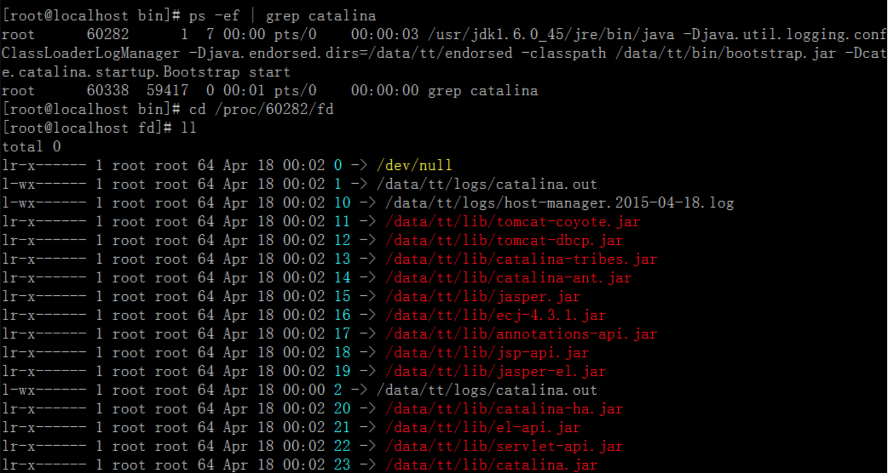
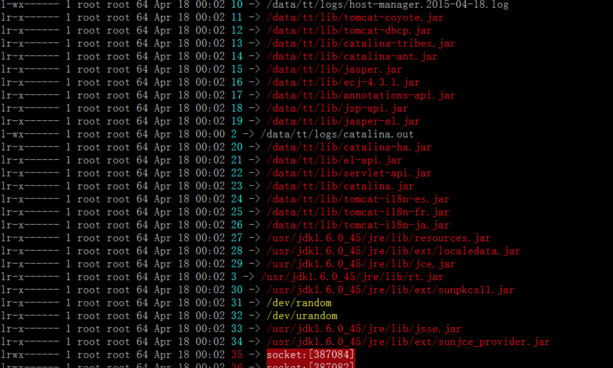
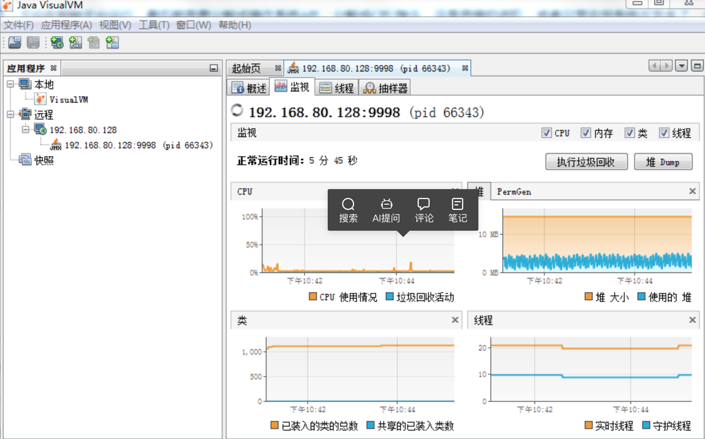
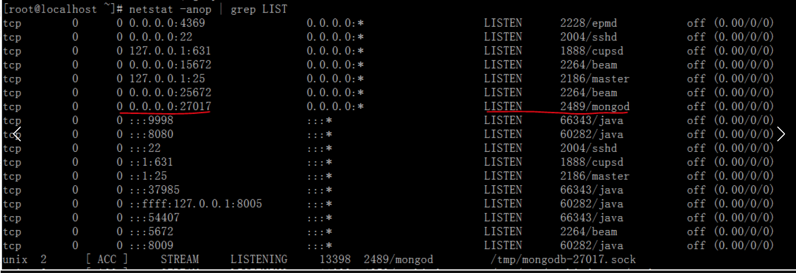
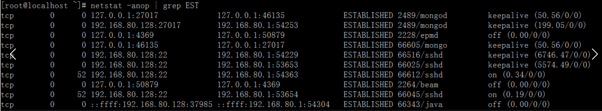
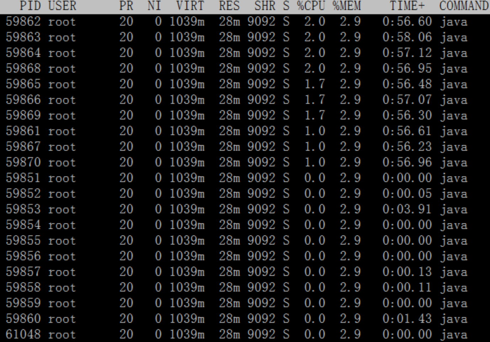
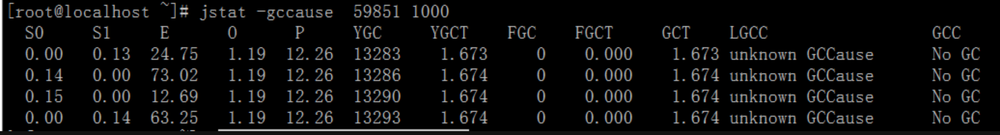
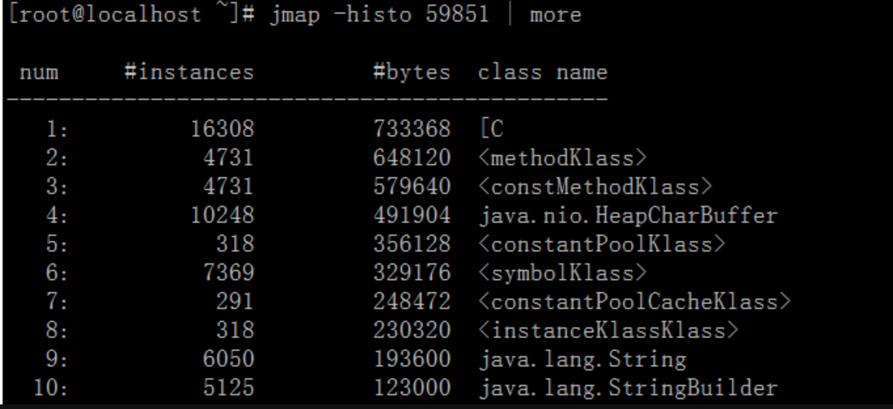
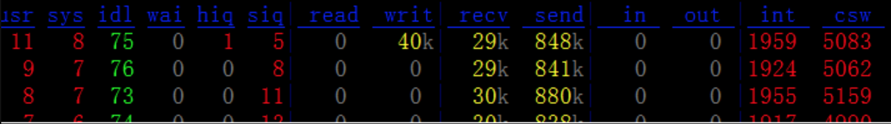
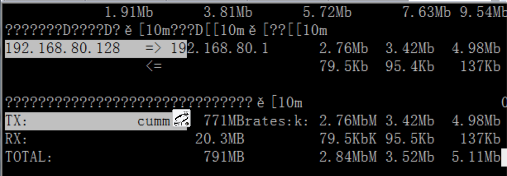

---

layout: single
title: Linux&java进阶（看清操作系统层面的事）
permalink: /java/java-and-linux.html

classes: wide

author: Bob Dong

---

# 前言

Java的生产系统，最常用的是Linux，所以当解决生产系统问题时，理解Linux系统，熟练掌握常用命令，对于解决问题，甚至对从更高层次理解Java，都是很有帮助的。

那么，应该怎么学Linux呢？上周五听了一次高手讲座，对于学习的串联、衔接、进阶，都是很有帮助的，所以分享到这里来。

本次讲座，先走马观花串一遍Linux命令，让其可以辅助我们的工作。不仅仅是讲几个命令而已，而是希望能看清楚一些操作系统层面上的事，达到理解和境界思想上的提升。

理解是灵魂，串讲是骨架，然后可以自行丰满血肉，这是目的。

本次讲座，特别适合“有一定理解，但是不深刻，或者恰恰处于进阶边缘”这种情况的人，一讲，一串，醍醐灌顶，理解会立刻深了一层。

原文地址：[Link](https://blog.csdn.net/puma_dong/article/details/45130201)。

# strace


strace常用来跟踪进程执行时的系统调用和所接收的信号。

```
strace -T -t -f   java Test >out 2>&1
strace -T -t -f p pid
```

通过这个工具，我们可以看到当Java程序，或者任何一种程序在Linux系统上运行时，实际上都是被分解成Linux API的。

讲这个命令的目的，是提示我们，可以用一种方式，用一种工具，比如strace，去理解我们的程序的运行。

语言，不论在哪种平台运行，最后都是要分解成操作系统API，分解成CPU指令。这是思维的进阶，或者我们忙于日常应用系统的开发，忘记了曾经的本质。

参考文章：

[使用strace, ltrace寻找故障原因的线索](http://blog.csdn.net/delphiwcdj/article/details/7387325)

[五种利用strace查故障的简单方法](http://blog.csdn.net/dlmu2001/article/details/8842891)

# 进程


pstree 是Linux的进程体系。

ps 是系统某个时刻的进程切面，代表某个时刻有多少个进程在运行。

因为在Linux下，包括进程、Socket等，都是以文件的形式存在的，内存中的。我们可以通过ps找出进程id，然后通过“运行时文件系统”，查看进程的任何信息。

从操作系统层面鉴定进程的信息（路径、jar、连接等），是完全准确的，比从配置文件里面查询准确，也不需要问别人。

```
ps -ef | grep catalina
cd /proc/60282/fd
```





可以进一步查看更多内容，比如：

```
a、写多少日志：ll | grep log
b、启动要那些jar：ll | grep jar
c、看到那些一闪一闪的了吗？那些是socket，代表谁连我了：ll | grep socket
d、对于这些socket句柄，我们可以进一步查看是什么进程：lsof | grep 387084
```

# 内存+CPU

top，这是应该熟悉的Linux命令，是Linux下常用的性能分析工具，能够实时显示系统中各个进程的资源占用状况，其显示的内容，和Windows的任务管理器是一样的。

free ，查看内存使用情况。

我们也可以在Windows下使用jvisualvm，以图形化的方式，查看Java应用的内存，线程，也可以把线程dump下来，比如，Test应用运行方式如下：

java -Dcom.sun.management.jmxremote.port=9998 -Dcom.sun.management.jmxremote.ssl=false -Dcom.sun.management.jmxremote.authenticate=false -Djava.rmi.server.hostname=192.168.80.128 Test

则可以在本地通过jvisualvm监控进程情况，在命令行输入jvisualvm，连接ip地址，之后右键这个远程连接，新建JMX连接，输入端口，则可以监控这个远程java进程了，截图如下：


# 网络

```
netstat -anop | grep LIST  
```

可以查看，都启动了那些端口，比如：



第六列“2489/mongod”，进程号2489，是mongod进程，在27017端口监听mongo接入。

有的时候，netstat不显示PID和应用，这一般是两个原因：权限不够，或者netstat版本太低，小于1.6，如果是版本太低，可以用：lsof -i :端口号，来找出PID。

参考文章：[netstat不显示进程名pid的bug](http://blog.chinaunix.net/uid-28337979-id-4230505.html)。

```
netstat -anop | grep EST
```

可以查看，端口都被谁连着呢，比如：



其他常用的：

```
strace -T -t -e network,poll curl www.baidu.com   我们可以看到从我们的机器，到百度的服务器，经过的路由路径
cat /etc/resolv.conf  可以看到域名解析服务器的顺序
cat /etc/hosts  The static table lookup for host name(主机名查询静态表)
```

# 线程

```
top -p 59851  shift+H，查看59851进程，有多少个线程。
```



第一列PID，线程ID，换算成16进制，就是线程栈中的NID。

```
jstack -l 59851查看，整个进程的信息
jstack -l 59851 | grep NID，只看一个线程栈的信息。
```

很多时候，查看问题的时候，都需要找出占用资源最多的线程，然后查看这个线程的线程栈信息。

这几个步骤，操作起来很容易，其实最最关键的是，线程栈dump下来了，要看得懂。

关于JVM线程的讲解，有一些非常好的文章，如下：

[JVM 内部运行线程介绍](http://ifeve.com/jvm-thread/)

[JVM合集](http://ifeve.com/category/jvm/)

# GC

Linux下一个进程里面的线程，都是共享内存的，所以当分析内存时 ，要看进程。

```
jstat -gccause  59851 1000   jstat，即JVM Statistics Monitoring Tool，用于收集HotSpot虚拟机各方面的运行数据
```



我们不怕YGC，YGC很频繁，很快，系统耗时极短，毫妙级，对于用户来说是没有感觉的；

但是FGC要注意，FGC进行的时候，JVM有可能是假死的，只进行FullGC，不处理其他请求，可能会持续几秒，FGC太多，说明YGC回收不了，太多的对象进入老年代，很快占满，系统肯定有问题的。

```
java -XX:+PrintFlagsInitial ，可以查看JVM的参数配置情况，比如，默认情况下，我们可以看到，Survior：Eden  = 1：8，New：Old  = 2：1。
```

```
jmap -histo 59851 | more  Memory Map for Java，生成虚拟机的内存转储快照（heapdump文件）
```



通过jmap，可以找出系统中可能有安全隐患（比如太多而不能回收）的对象。

通过这些手段，不用分析代码，不用停机，就可以找出问题，解决问题。

jps、jstat、jstack、jmap，这些不是Linux命令，而是JDK写好的放在rt.jar里面的用于辅助诊断的Java APP。

GC是Java程序员的基本功，应该理解的很清晰。

# dstat和iftop

**场景1：演示通过sftp上传文件**

可以在top中看到sshd和sftp耗费CPU资源很大，因为sftp是基于sshd的；可以在dstat中看到，receive流量很大。

**场景2：演示http请求百度首页，通过ss5代理压测，在ss5机器中，dstat显示的send和recv几乎一样。**

和我们通常理解的，应该会有很少的发出数据，和很多的接收数据不一致。原因是：

这种理解不对的，作为ss5代理的机器，既从远端接收到大量数据，同时把接收到的大量数据，转发给它所代理的机器，所以有这个网络现象。


这个时候，我们通过iftop，则可以清楚的看到IP到IP的发出发入数据包。

所以，知道，借助于工具，基于Linux的知识，基于Java的知识，定位问题，找出问题，是很关键的。

iftop 是第三方的，是一个实时流量监控工具：

主要用来显示本机网络流量情况及各机器相互通信的流量集合，如单独同那台机器间的流量大小，非常适合于代理服务器和iptables服务器使用。

官方网站：<http://www.ex-parrot.com/~pdw/iftop/>。

安装步骤：

yum -y install flex byacc  libpcap ncurses ncurses-devel libpcap-devel

wget http://soft.kwx.gd/tools/iftop-0.17.tar.gz #获得软件包

tar zxvf iftop-0.17.tar.gz                      #解压

cd iftop-0.17                                  #进入目录

./configure                                    #使用默认配置

make && make install                            #编译并安装

如果libpcap包装不上的话，需要到http://pkgs.org/自行下载rpm进行安装。

dstat是Linux自带的，可以yum安装。


dstat截图：


**iftop截图：**



# “|”  管道操作。

连接、过滤，这是管道的作用，就像连接千家万户的自来水管。

管道操作符，按行给数据，一行一给，把上个命令的输出，变成下个命令的输入。

经常使用的参数-c ，类似于 SQL中的group by。

在linux中，要把日志文件，当成数据库表，日志文件也是有行有列的。日志要标准，要有规律，就会很方便的分割查找。

我们可以借助less、more、cat、sort、uniq、grep、awk等命令，很方便的分析日志。

另外，awk是一个强大的文本分析工具，awk在对数据分析并生成报告时，很强大。简单来说awk就是把文件逐行的读入，以空格为默认分隔符将每行切片，切开的部分再进行各种分析处理。

# 其他常用命令

```
df -h  显示磁盘分区使用情况
du -sh /root/temp  显示某个文件夹的大小    
find /root/temp -type f -name "*.txt" | xargs grep "main"  在/root/temp目录下，在普通文件中，在扩展名为txt的文件中，查找含有main字符串的行
lsof -l 显示所有的socket句柄
lsof | grep deleted  刚刚rm或者echo冲文件内容后，看看空间有没有释放
sed 文件内容查找和替换
vim 文本编辑器，常用就会熟悉。开始的时候记录最常用的，比如，翻屏：CTRL+U（D），2gg，3dd，3dw，yy，/查找，?查找。
```

# 学会分析错误的思路

学会错误的模拟重现，会模拟重现就能解决。模拟重现的手段：可以开发一些质量差的代码，把错误做出来。

工具只是帮助我们定位问题的，帮我们记录发生问题时的操作系统切面，要理解这个切面所代表的意义、所隐含的异常，还需要对相关基础知识的深刻了解。比如：

用jstat看GC，需要对Java的内存管理、垃圾收集技术深入了解；
用netstat看网络，需要对网络知识，特别是TCP，有深入了解；
用jstack转储线程栈，需要对Java线程的知识，有深入了解。