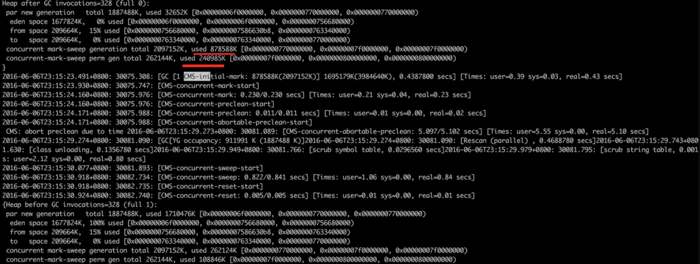
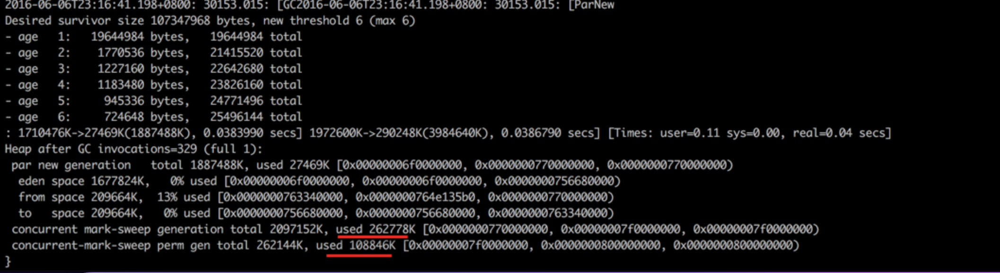
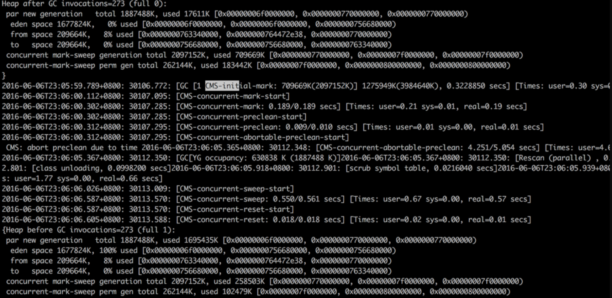
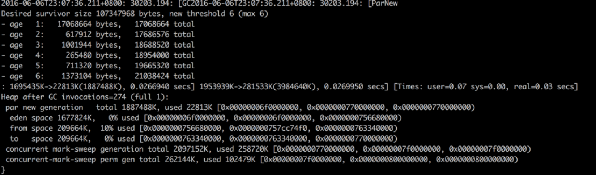

---

layout: single
title: 读一本书《Java性能权威指南》
permalink: /java/java-performance-definitive.html

classes: wide

author: Bob Dong

---

英文版《Java Performance The Definitive Guide》，出版于2014年，中文版出版于2016年，相比于《深入理解Java虚拟机》，讲的更加透彻、准确。适合读一遍，然后做长期参考。

作者Scott Oaks是Oracle公司的一位架构师，专注研究Oracle中间件软件的性能。加入Oracle之前，他曾于Sun Microsystem公司任职多年，在多个技术领域都有建树，包括SunOS的内核、网络程序设计、Windows系统的远程方法调用（RPC）以及 OPEN LOOK虚拟窗口管理器。1996年，Scott成为Sun公司的Java布道师，并于2001年加入Sun公司的Java性能小组——从那时起他就一直专注于Java的性能提升。此外，Scott也在O'Reilly出版社出版了多部书籍，包括Java Security、Java Threads、JXTA in a Nutshell和Jini in a Nutshell。

大约两年半之前，根据同事推荐看了《深入理解Java虚拟机》，这是一本入门JVM的好书，但也发现看书的过程中，很多自己想要更深入、更准确、更广泛了解的地方，还是要查询互联网，但是这本书，可以统统扫除那些疑惑。

看完这本书，大约用了1个月，断断续续，中间经过一个端午节，还速读了7部小说《明朝那些事》，大致看了《南渡北归》，扫了几眼《人类简史》，很多也是，看了，忘了，真是想找到一种克服遗忘的办法。但是据说，克服遗忘最好的办法是重复，重复，需要的是时间，于是也越发感觉时光如电。。。

关于遗忘，也可以从学习方法角度找下原因，此前有小总结：http://blog.csdn.net/puma_dong/article/details/45345397#t0


第一章 导论


本书的侧重点是拓展知识的深度。本书的知识分为两大类：JVM自身的调优，Java平台（既指Java语言，比如线程和同步，也指JavaAPI，比如XML解析性能）的特性对性能的影响。

请记住，JVM只占整体性能的一小部分，更多的是操作系统、数据库，其他系统，不过本书不是讲整体分析的，本书假设性能瓶颈在Java。


第二章 性能测试方法


原则1：测试真实应用；

原则2：理解批处理流逝时间、吞吐量和响应时间

原则3：用统计方法应对性能的变化

原则4：尽早频繁测试

本章的目的，是给出一些性能测试的理论和定量方法。


第三章 Java性能调优工具箱


欲善其事，先利其器。几个月前做了几个网线，不知道压线是否通了，每条都试一下，真是麻烦，于是买了的测线仪，压完就知道结果，方便多了。

看Java，看JVM，我们也需要这样的工具。

1、看操作系统的：CPU、磁盘、网络，用linux的操纵系统命令。

2、看Java的：线程、类、堆、栈，用jstack，jcmd等命令。

3、采样、探查

4、JFR，Java飞行记录仪，收费版JVM才有的。

常用的Linux操作系统命令，以及Java性能相关的命令：jcmd、jstack、jmap、jstat、jinfo的常用参数，要纯熟。


第四章 JIT编译器


JIT编译，我们的调优参数并不多，还是要学习熟悉一下。

以前看《深入理解Java虚拟机》时，想知道机器默认是使用client/server模式，查了很多资料，未必准确，而本章就有介绍。


第五章 垃圾收集入门


本章介绍了垃圾收集的入门知识。比如选择GC算法，调整堆、永久代，控制并发等。

看过《深入理解Java虚拟机》，可能依然形成一些粗略了解形成的错误观念。举两个例子。

1、Stop The World，请问新生代的GC，会STW吗？老年代呢？

实际的结果是，所有的新生代GC算法，都是100%的STW，因为时间短，一般都是几毫秒~几十毫秒左右，对于大部分应用都是可以接受的。

老年代GC算法，常用的CMS，会尽量不STW，只有在经过一定失败条件，CMS无法继续进行时，会退化成使用SerialOld，才会STW，一次老年代GC，大约需要1秒，于存活对象大小成正比，如果老年代全部STW，这个1秒，真是无法承受。

我写过一个测试代码，验证过STW，如下：

```
/**
 * java -Xms1000m -Xmx1000m Test2
 * 可以看到，每次垃圾回收（Young GC），都是Stop the world，导致方法的执行时间 > 15毫秒，增加的时间=Young GC耗费的时间
 */
public class Test2 {
	public static void main(String[] args) throws Exception {
		
		final List<Object> os = new ArrayList<Object>();
		
		new Thread(new Runnable() {
			@Override
			public void run() {
				int i = 0;
				while(true) {
					for(int j=0;j<1000;j++)
						os.add(new java.util.concurrent.ConcurrentHashMap<String, String>());
					try {
						Thread.sleep(1);
					} catch (InterruptedException e) {
					}
					i++;
					if(i == 300) {
						os.clear();
						i = 0;
					}
				}
				
			}
		}).start();
		
		while(true) {
			
			long start = System.currentTimeMillis();
			Thread.sleep(15);
			long m = System.currentTimeMillis() - start;
			if(m>20)
				System.out.println(m);
		}
	}
}
```

2、System.gc

这行Java代码，会不会导致GC。很多人说不会，可能是看过一些资料，或者人云亦云。

遇到这种问题，不用争论，写行代码试验一下就知道了，实践出真知。

答案是：这行代码会产生GC，回收所有的堆空间，新生代、老年代、永久代。通过 jstat -gccause -h10 pid 1000 可以清楚的看到。

技术是件很严肃的事情。


第六章 垃圾收集算法


详细讲了3类GC收集器的原理：以最大CPU利用率为目的的Throughput（parallel），最小响应延迟为目的的CMS，和CMS类似但是适用于大内存的G1。

一些高级调优选项。

在看本章的P116，“CMS收集器的永久代调优”时，从JVM角度消除了一个生产报警。场景描述如下：

有一个调用频繁的服务，一天大约调用100万次，每次都是通过反射，从Spring容器拿出一个对象（因为这个服务有状态，所以必须是prototype），经过代码跟踪，发现这种方式，在生成新对象的过程中，总会产生一个类似这样的新类： sun.reflect.GeneratedSerializationConstructorAccessor10079，大约5个小时，256m的永久代就会超过90%，监控开始报警，然后permgen到达100%时，会进行full gc，回收所有的堆（新生代、老年代、永久代）。





-XX:+CMSPermGenSweepingEnabled

-XX:CMSInitiatingPermOccupancyFraction=70

CMS接管Perm，70%时并发进行垃圾收集，避免满了再FullGC。在70%时，只会回收新生代和永久代，不会回收老年代。





第七章 堆内存最佳实践


本章首先介绍了使用jmap命令或者其他工具进行堆转储，然后通过Eclipse Memory Analyze工具分析转储文件，理解浅内存、保留内存、深内存，及EMA的用法。

然后介绍了几种常见的内存溢出场景。

然后从减少内存使用绝度（减小对象大小、延迟初始化、不可变对象和标准化对象、字符串的保留），以及对象生命周期管理（对象重用、弱引用/软引用/其他引用）绝度，讨论了堆内存最佳实践方法。

以上实际都是编程的绝度。


第八章 原生内存最佳实践


首先介绍了原生内存使用的理论知识。

在Java8中，通过开启-XX:NativeMemoryTracking=off|summary|detail，然后可以通过命令 jcmd pid VM.native_memory summary查看原生内存使用情况。

介绍了操作系统级别的JVM优化：大页和压缩的OOP。

页是OS管理内存的一个单元，也是OS分配内存的最小单元：要分配一个字节，OS一定会分配一个整页。

介绍了Linux大页和Linux透明大页（从2.6.32开始）：cat(echo always > ) /sys/kernel/mm/transparent_hugepage/enabled

压缩的OOP（ordinary object pointer 普通对象指针），在java7和更新的版本中，只要堆小于32G，压缩的oop默认就是启用的，不用参数-XX:+UseCompressedOops，如果堆大于32G，要大于一定数值，因为需要额外的空间弥补非压缩引用所使用的空间，平均而言，对象引用会占用20%的堆空间，38G是个不错的起点。


第九章 线程于同步的性能


拿到这本书后，基于对线程知识的理解（过去看过关于线程的书，查询过很多资料，总结过博客：http://blog.csdn.net/puma_dong/article/details/37597261），所以最先看的就是这一章。

本章开始讲了线程池、ThreadPoolExecutor（根据应用场景:CPU/IO密集等，设置最大线程数、最小线程数、线程池任务大小、设置ThreadPoolExecutor大小）、ForkJoinPool、线程同步，以及JVM线程调优（调节线程栈大小、偏向锁、自旋锁、线程优先级）。

最后讲解了线程监视于分析，最常用的是jstack，我们需要数量的看懂jstack的输出结果，并能快速的分析出存在的问题。


第十章 Java EE性能调优


本章介绍了一些Java EE技术，及常见的调优，比如Servlet、Jsp、Http、EJB（过时的技术）、数据交换技术（XML、JSON）、对象序列化、数据传输（Http、WebService、RESTFull）

本章，个人觉得，其他简单看看，着重看看对象序列化就行了。


第十一章 数据库性能的最佳实践


本章所讲的理论，更像是数据库相关的理论。

在日常的应用开发中，关于数据库相关，我们往往是应用持久化框架，所以从开发绝度考虑DB性能调优，更多的是在持久化框架配置方面。


第十二章 Java SE API技巧


本章讲解了一些Java SE API技巧。

比如缓冲式I/O、类加载（双亲委派、并行加载）、随机数（伪随机、真正的随机）、Java原生接口、异常、字符串的性能、日志、集合类等。
