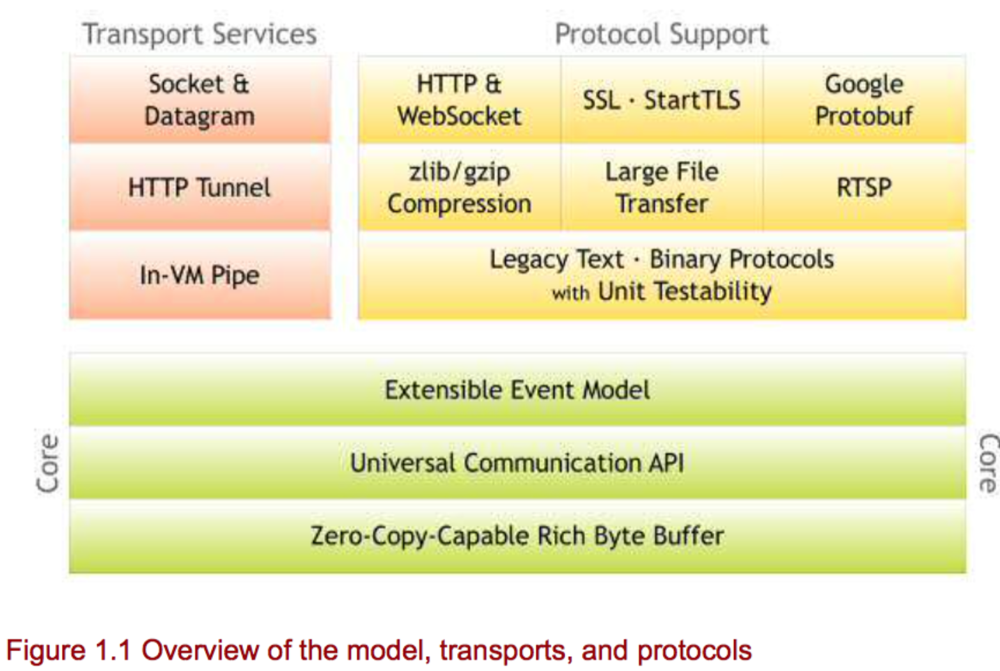
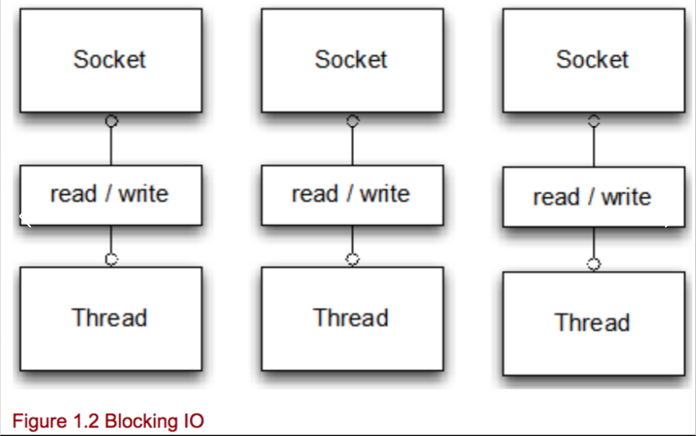
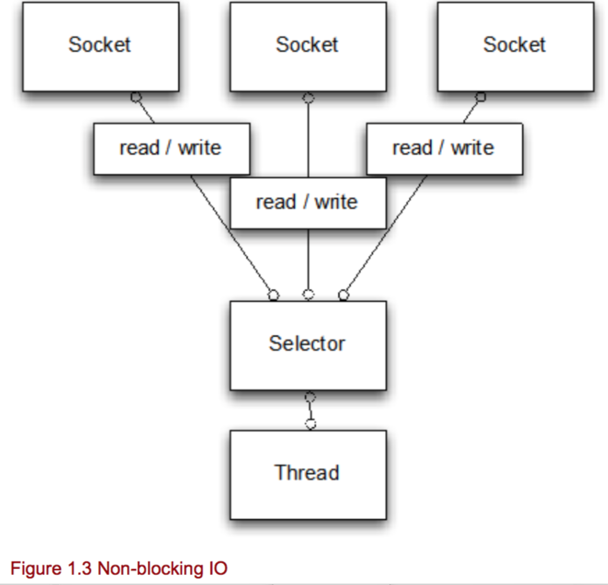
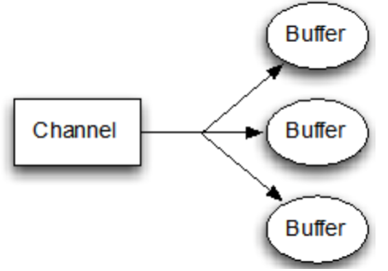
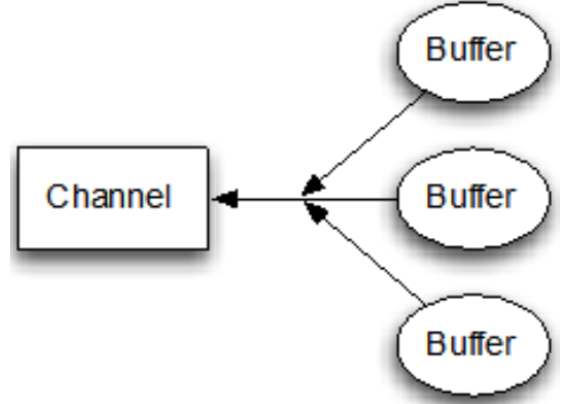
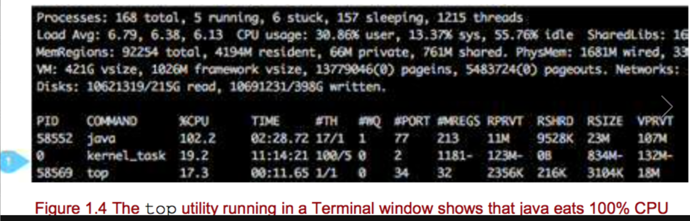

---

layout: single
title: 读一本书《Netty in Action V5》-Chapter 1
permalink: /mw/netty-in-action-1.html

classes: wide

author: Bob Dong

---

# 前言

本篇基于MEAP Edition进行翻译，MEAP即Manning Early Access Program，[Manning](https://www.manning.com/)是一个出版社的名字，EAP是早期预览版。

我计划翻译这本书的时候，已经有了Netty in Action V10，但是我感觉从基础的Java NIO 讲起，能有一些对比，更容易理解，所以就翻译了V5。另外早期预览版，和正式出版相比，代码和文字的错误，都较多一些，要注意一下。

Norman Maurer，是英文原著的作者，Netty 核心开发者之一，目前就职于苹果公司，Norman Maurer的个人主页：http://normanmaurer.me/。

本书的调试过之后，可运行的源码，都可以Github下载：https://github.com/pumadong/netty-in-action-v5 。

在本书的翻译过程中，感觉写的有些啰嗦，在代码和文字中都有一些错误，力求在翻译的过程中根据自己的学习和理解，修复这些代码和文字错误。


**读本书之前，先让我们简单了解，Netty是什么？**

Netty是一套框架，万紫千红的Java生态中的一套通讯框架，一套传输层的通讯框架。

这套框架，比较偏底层一些（传输层，你就说Socket层也行），所以比较少被应用开发直接拿来使用，而是在一些广为流传的RPC服务治理框架中，作为底层的通讯框架。

做通讯开发的工程师少，做应用开发，特别是数据库操作的工程师众多；所以，做个类比，用JDK中的SQL包可以做数据库开发，用MyBatis框架也可以做数据库开发，用JDK中的BIO/NIO/NIO.2可以做通讯开发，用Netty也可以做通讯开发；通讯开发中的Netty框架，就像数据库开发中的MyBatis框架。

**其他参考：**

https://zhuanlan.zhihu.com/p/26065628


## 第1章 Netty与Java NIO APIS


**本章包含内容**


- Netty架构
- 为什么需要NIO
- BIO和NIO
- JDK的NIO中的问题以及Netty的解决方法


本章介绍Netty，从Java的NIO开始讲起。

如果你对Java网络开发了解较少，可以从本章开始；如果你对Java网络开发比较熟悉，也可以阅读本章作为复习；如果你对使用Java的NIO和NIO V2开发很精通，可以从第2章开始阅读，在第二章，你将开始运行第一个Netty程序。

Netty是一个基于NIO的客户端-服务器通讯框架，帮助我们更快、更容易的开发易于扩展的网络应用。它通过提供一套易用的API，抽象了网络开发的复杂性，把业务逻辑代码从网络处理代码中解耦。Netty是为NIO而构建，它的所有API都是异步的。

对于网络应用，无论是基于Netty还是其他的NIO API，都会有可扩展性问题。异步是Netty的一个核心特性，本章讨论了同步IO和异步IO，并以此证明了，为什么异步代码解决了扩展性问题，以及如何解决了扩展性问题。

对于初涉网络开发者，本章带你理解网络应用，教你分别利用Java网络API和Netty开发网络应用，比较了两种方式的优点和缺点，并展示了Netty如何解决Java网络API的问题，像Epoll问题和内存泄露。

当读到本章结尾的时候，你应该已经能明白：Netty是什么，能做什么。对Java NIO和异步处理也比较了解了。当我们逐渐阅读本书的其他章节时，这些都能带来帮助。


### 1.1 为什么选择Netty？

用David Wheeler 的一句话来说，“计算机科学中的所有问题，都会被在另一个层次间接解决”。作为一个NIO通讯框架，Netty提供了这样层级的解决方案，通过对低级API进行高层抽象，简化了TCP/UDP网络应用开发。

#### 1.1.1 网络框架，各有不同


Netty，快速而易用，同时不会带来维护性和性能问题。这得益于吸取了过去大量的经验教训，像FTP/SMTP/HTTP/WebSocket/SPDY，以及其他各种二进制/文本协议的实现，对于这些经验教训，Netty的创建者在设计时投入了巨大的关注。最终，不夸张的说，Netty成功做到了易用、性能、稳定、可扩展。

很多知名公司和开源组织在使用Netty并做出贡献，包括RedHat, Twitter, Infinispan, and HornetQ, Vert.x, Finagle, Akka, Apache Cassandra, Elastic Search，还有很多。公平的说，Netty的很多特性也是这些项目需要的结果。在过去的几年中，Netty以及变成了Java世界中最广泛使用的网络框架之一，并在2011年获得了the Dukes Choice Award 。

也是在2011年，Netty的创建者Trustin Lee ，离开了RedHat，加盟了Twitter。从那时起，Netty开始独立发展，任何公司都可以为Netty贡献力量。RedHat和Twitter都在使用Netty，所以，毫无争议的，这两家公司是Netty的最大贡献者。无论是Netty的使用者，还是贡献者，都在持续增长，Netty的社区非常活跃，Netty项目充满生机。


#### 1.1.2 Netty拥有丰富的功能


通过本书，你将要学到Netty的很多特性。Figure 1.1 列出了一些Netty支持的传输和协议，简要概述了Netty的架构。



除了支持广泛的传输和协议之外，Netty对开发领域的各个方面都有良好支持（table 1.1)。

**Table 1.1 Netty给开发者提供了全套工具。**

设计

- 适用于各种传输类型的统一的API--阻塞或者非阻塞Socket
- 使用灵活
- 简单并且强大的线程模型
- 支持无连接的数据报Socket
- 易于重用的链式设计

易用

- 大量的文档和例程参考
- 除了JKD1.6（或者更高版本），无需更多依赖。有部分特性需要Java1.7支持，对于需要额外依赖的特性，都是可选的。

性能

- 相比核心Java API，有更好的吞吐量，更低的延迟
- 通过线程池重用，消耗更少资源
- 最小化非必要的内存拷贝

鲁棒性

- 不再因为连接的快/慢/过载，而产生OutOfMemoryError
- 不再有，高速网络的NIO应用中，经常出现的读写比例失衡

安全性

- 完全的SSL/TLS和StartTLS 支持
- 运行在一个像applet或OSGI一样的受约束的环境中

社区

- 更新迅速，迭代频繁
- 社区活跃

为了上表列出的这些特性，Netty解决了Java NIO中的bug和限制，我们无需再为这些问题担心。

预览过Netty的特性之后，是时候去详细了解异步处理以及其后面的思想了。NIO和Netty大量使用了异步代码，理解了为什么这样做，能帮助我们更好的使用它们。在下一个小节中，我们来看看，为什么我们需要异步API。


### 1.2 异步设计


Netty所有的API都是异步的。异步处理不是新东西，这种思想已经产生很久了。长久以来，IO经常是瓶颈所在，异步处理变得越来越重要。但是，异步处理怎么工作？需要什么样的工作模式？

相比同步等待完成，通过开启一个新任务，在我们关心的事件完成之后进行通知，这种异步处理方式让你更有效的利用资源。因为你可以在这个任务运行的时候，做其他的工作。

本小节，将开始解释，实现异步API的两种最通用的方式，并且讨论了这两种方式技术上的不同。


#### 1.2.1 回调


回调是异步处理中经常使用的技术。回调，被作为参数，传递给方法，然后在方法完成时，执行回调。你可以在JavaScript中看到回调，回调是这种语言的核心。下面的代码，演示了如何利用这种技术获取数据。

https://github.com/pumadong/netty-in-action-v5/blob/master/src/main/java/chapter1/CallbackExample.java

```
package chapter1;
 
/**
 * 演示回调
 *
 */
public class CallbackExample {
    
    public static void main(String[] args) {
        CallbackExample callbackExample = new CallbackExample();
        Worker workder = callbackExample.new Worker();
        workder.doWork();
    }
 
    interface Fetcher {
        void fetchData(FetchCallback callback);
    }
 
    interface FetchCallback {
        void onData(Data data);
 
        void onError(Throwable cause);
    }
 
    class Data {
        
        private String content;
 
        public Data(String content) {
            super();
            this.content = content;
        }
 
        public String getContent() {
            return content;
        }
 
        public void setContent(String content) {
            this.content = content;
        }
 
        @Override
        public String toString() {
            return "Data [content=" + content + "]";
        }
        
    }
 
    class Worker {
        public void doWork() {
            Fetcher fetcher = new Fetcher() {
                @Override
                public void fetchData(FetchCallback callback) {
                    // begin business
                    // ......
                    // end business
                    
                    // executing callback
                    callback.onData(new Data("result is coming!"));
                    callback.onError(new RuntimeException("result is error!"));
                }
            };
            fetcher.fetchData(new FetchCallback() {
 
                // #1  Call if data is fetched without error
                @Override
                public void onData(Data data) {
                    System.out.println("Data received: " + data);
                }
 
                // #2 Call if error is received during fetch
                @Override
                public void onError(Throwable cause) {
                    System.err.println("An error accour: " + cause.getMessage());
                }
 
            });
        }
    }
}
```

Fetcher.fetchData()方法，有一个回调类型的参数FetchCallback，当方法执行完毕后，回调被调用，并且可以根据方法的执行结果，调用不同的方法。

所以，你可以把回调中的方法，从“Fetcher的调用者”，转移到其他的线程中。至于FetchCallback这个回调中的方法什么时候会被执行，是没有保证的，完全根据Fetcher.fetchData()的执行结果来确定。

回调这种解决办法有个问题，当我们链式的调用的很多回调方法，可能产生“千层面”式样的纠缠不清的代码，有人认为这样的代码是难以阅读的，但是我认为它更是一个品味和风格的问题。例如，Node.js，基于JavaScript，越来越流行。它就大量使用了回调，一些人认为也是很容易用它开发应用程序的。


#### 1.2.2 Futures


异步处理的第二项常用技术是Future。Future是一个抽象，代表一个异步执行的结果，只有异步执行结束后才是有结果的。一个Future对象，可以持有正常计算的结果，也可以持有失败的计算结果，比如异常。

Java，在java.util.concurrent包种，提供了一个Future接口，用来持有异步处理的结果。

例如，在下面的例子中，当你传递一个Runnable对象给ExecutorService.submit()方法，你得到一个Future返回，通过Future，你可以检查是否执行已经完成了。

https://github.com/pumadong/netty-in-action-v5/blob/master/src/main/java/chapter1/FutureViaJdkExample.java

```
package chapter1;
 
import java.util.concurrent.Callable;
import java.util.concurrent.ExecutorService;
import java.util.concurrent.Executors;
import java.util.concurrent.Future;
 
/**
 * 演示JDK中的Future
 */
public class FutureViaJdkExample {
    public static void main(String[] args) {
        ExecutorService executor = Executors.newCachedThreadPool();
        Runnable task1 = new Runnable() {
            @Override
            public void run() {
                // do some heavy work
                try {
                    Thread.sleep(1000 * 1);
                } catch (InterruptedException e) {
                    e.printStackTrace();
                }
            }
        };
        Callable<Integer> task2 = new Callable<Integer>() {
            @Override
            public Integer call() throws Exception {
                // do some heavy work with result
                try {
                    Thread.sleep(1000 * 2);
                } catch (InterruptedException e) {
                    e.printStackTrace();
                }                
                return 0;
            }
        };
        
        Future<?> future1 = executor.submit(task1);
        Future<Integer> future2 = executor.submit(task2);
        while(!future1.isDone() || !future2.isDone()) {
            System.out.println("do something else...");
            try {
                Thread.sleep(500);
            } catch (InterruptedException e) {
                e.printStackTrace();
            } 
        }
        executor.shutdown();
    }
}
```

你也可以在你自己的API中使用这个技术。例如，你可以使用Future实现一个Fetcher。

https://github.com/pumadong/netty-in-action-v5/blob/master/src/main/java/chapter1/FutureExample.java

```

package chapter1;
 
import java.util.concurrent.ExecutionException;
import java.util.concurrent.Future;
import java.util.concurrent.TimeUnit;
import java.util.concurrent.TimeoutException;
 
/**
 * 演示Future
 *
 */
public class FutureExample {
    
    public static void main(String[] args) {
        FutureExample callbackExample = new FutureExample();
        Worker workder = callbackExample.new Worker();
        workder.doWork();
    }
 
    interface Fetcher {
        Future<Data> fetchData();
    }
 
    class Data {
        
        private String content;
 
        public Data(String content) {
            super();
            this.content = content;
        }
 
        public String getContent() {
            return content;
        }
 
        public void setContent(String content) {
            this.content = content;
        }
 
        @Override
        public String toString() {
            return "Data [content=" + content + "]";
        }
        
    }
 
    class RunnableImpl implements Runnable {
        private FutureImpl futureImpl;
        public RunnableImpl(FutureImpl futureImpl) {
            this.futureImpl = futureImpl;
        }
        @Override
        public void run() {
            // begin business
            // ......
            // end business
            
            try {
                Thread.sleep(1000 * 2);
            } catch (InterruptedException e) {
                e.printStackTrace();
            }
            futureImpl.setFinished();
        }
        
    }
    
    class FutureImpl implements Future<Data> {
        private Boolean finished = false;
        private Data data = null;
        public void setFinished() {
            finished = true;
            data = new Data("result is coming!");
        }
        @Override
        public boolean cancel(boolean mayInterruptIfRunning) {
            return false;
        }
        @Override
        public boolean isCancelled() {
            return false;
        }
        @Override
        public boolean isDone() {
            return finished;
        }
        @Override
        public Data get() throws InterruptedException, ExecutionException {
            return data;
        }
        @Override
        public Data get(long timeout, TimeUnit unit) throws InterruptedException, ExecutionException,
                TimeoutException {
            return null;
        }
    }
    
    class Worker {
        public void doWork() {
            Fetcher fetcher = new Fetcher() {
                @Override
                public Future<Data> fetchData() {
                    FutureImpl future = new FutureImpl();
                    RunnableImpl runnable = new RunnableImpl(future);
                    new Thread(runnable).start();
                    return future;
                }
            };
            Future<Data> future = fetcher.fetchData();
            while(!future.isDone()) {
                System.out.println("do something else...");
                try {
                    Thread.sleep(500 * 1);
                } catch (InterruptedException e) {
                    e.printStackTrace();
                }
            }
            try {
                System.out.println(future.get());
            } catch (InterruptedException | ExecutionException e) {
                e.printStackTrace();
            }
        }
    }
}
```

在上面的例子中，你检查fetcher是否完成，如果没有完成，我们就去做一些其他的工作。有时，我们可能感觉使用future不优雅，因为我们要间隔性的检查Future的状态，来看任务是否完成，而用回调的话，当任务完成后我们可以立刻被通知到。


看过future和callback这两种异步执行中最通用的技术后，你可能会想问哪一种更好，这真的没有一个准确的答案。事实上，这两种技术，Netty都使用到了。

在下一个小节中，开始介绍使用JDK开发网络应用，从阻塞IO到NIO和NIO.2。这些基础只是，对于本书随后章节的学习，是完全必要的。如果你很熟悉Java网络API，快速阅读一遍下个小节也可以，温故而知新。


### 1.3 JVM中的阻塞IO和非阻塞IO


互联网的持续发展，大大提高了对于网络并发处理能力的需求。在这类应用中，效率变得非常重要。幸运的是，Java提供了开发高效、可扩展的网络应用的工具，并且从JDK1.4开始，NIO API的出现，让我们可以写成高性能的网络应用。在JDK 7中，又提供了NIO.2，被认为是一个更高级别的封装。

用Java进行网络相关的开发，可以选择一下两种方式：


- BIO，即众所周知的阻塞IO
- NIO，即new/non-blocking IO

New or non-blocking IO NIO中的N一般被认为是non-blocking（非阻塞），而不是新（new）。可能NIO相关API刚出现时，确实比较新，一些人叫做新IO，但是到现在，这个技术已经这么多年了，已经没有

Figure 1.2 演示了BIO如何用一个线程去处理一个连接，从图示我们可以看出，线程和连接是1：1的关系，所以，应用处理能力受限于JVM可以生成的线程的数目。



相反地，Figure 1.3演示了NIO，它用一个选择器去处理多个连接。



记住这些图示，可以加深对BIO和NIO的理解。下面，我将用一个简单的echo server程序，去演示BIO和NIO的差异，这个echo server程序可以接受客户端的请求，并把接收到的数据返回给客户端。


#### 1.3.1 基于阻塞IO的EchoServer


下面将要演示的第一个版本的EchoServer应用，基于阻塞IO，是最常用的开发网络应用的方式，这主要因为两个原因：阻塞IO在早期的Java版本中广泛使用，并且相对易用。

除非你需要很强的可扩展性，否则阻塞IO一般都能满足要求。下面的例程演示了这种EchoServer的实现。

https://github.com/pumadong/netty-in-action-v5/blob/master/src/main/java/chapter1/PlainEchoServer.java

```
package chapter1;
 
import java.io.BufferedReader;
import java.io.IOException;
import java.io.InputStreamReader;
import java.io.PrintWriter;
import java.net.ServerSocket;
import java.net.Socket;
 
/**
 * 简单的BIO Socket Server
 */
public class PlainEchoServer {
    public static void main(String[] args) throws IOException {
        PlainEchoServer plainEchoServer = new PlainEchoServer();
        System.out.println("PlainEchoServer start at 8888..." + "\n");
        plainEchoServer.serve(8888);
    }
 
    public void serve(int port) throws IOException {
        // #1 Bind server to port
        final ServerSocket socket = new ServerSocket(port);
        try {
            while (true) {
                // #2 Block until new client connection is accepted
                final Socket clientSocket = socket.accept();
                System.out.println("Accepted connection from " + clientSocket);
                // #3 Create new thread to handle client connection
                new Thread(new Runnable() {
                    @Override
                    public void run() {
                        BufferedReader reader = null;
                        PrintWriter writer = null;
                        try {
                            reader = new BufferedReader(new InputStreamReader(
                                    clientSocket.getInputStream()));
                            writer = new PrintWriter(clientSocket.getOutputStream(), true);
                            // #4 Read data from client and write it back，while(true)，会一直读取，直到我们认为应该结束读取
                            while (true) {
                                String data = reader.readLine();
                                // 小议socket关闭：http://blog.whyun.com/posts/socket/
                                // Java Socket 编程：http://haohaoxuexi.iteye.com/blog/1979837
                                if(data == null) {
                                    break;
                                }
                                System.out.println("Accepted data " + data);
                                writer.println(data);
                                writer.flush();
                            }
                        } catch (IOException e) {
                            e.printStackTrace();
 
                        } finally {
                            try {
                                if(reader != null) {
                                    reader.close();
                                }
                                if(writer != null) {
                                    writer.close();
                                }
                                System.out.println("Server_Close：" + clientSocket + "\n");
                                clientSocket.close();
                            } catch (IOException ex) {
                                // ignore on close
                            }
                        }
                    }
                    // #5 Start thread
                }).start();
            }
        } catch (IOException e) {
            e.printStackTrace();
        }
    }
}
```

如果你曾经开发过Java网络应用，是不是看起来很眼熟。但是让我们停下来，思考一下：对于这种设计，可能会出现什么问题？

让我们重新看看这几行：

```

final Socket clientSocket = socket.accept();
   new Thread(new Runnable() {
       @Override
       public void run() {
... }
}).start();
```

每一个连接，都需要一个线程。你可能会争论，我们可以通过线程池去减小生成线程的开销，但这种方式带来的帮助依然是有限度的。最根本的问题依然存在：能被并发处理的客户端端请求，受限于服务器端能同时活动的线程数。当你的应用需要去处理海量的并发客户端请求时，这就是一个大问题了。

如果用NIO，这个问题就不会出现。在下一个版本的EchoServer中，我会证明这一点。但是首先，先让我们来了解一些NIO的概念。


#### 1.3.2 非阻塞IO基本概念


Java 7新提供了NIO.2，它的API和实现，和前一个版本的从Java 4开始的NIO是不同的。然而，这两组API也不是完全不同，它们共享一些通用特性。例如，这两组实现，都使用一个叫做 ByteBuffer 的抽象类作为数据容器。


##### ByteBuffer


对于NIO，ByteBuffer是非常重要的，实际上，对于Netty也是。ByteBuffer可以被分配在JVM的堆内存上，也可以被分配在直接内存上。一般来说，传输数据到通道时，用直接内存更快，但是分配和释放成本也更高。在这两种场景中，ByteBuffer相关的API是一样的，提供了统一的访问和操作数据的方式。ByteBuffer允许同样的数据在ByteBuffer实例之间共享，而无需内存拷贝。更进一步来说，它允许分割和其他的操作，来限制可见的数据。

分割 分割一个ByteBuffer，允许生成一个新的ByteBuffer，共享原始ByteBuffer的数据，并且仅仅暴漏原始数据的一部分。对于最小化内存拷贝，这是非常有用的。

ByteBuffer的典型应用，有下面这些：


- 写数据到ByteBuffer
- 调用ByteBuffer.flip()，切换读写模式
- 从ByteBuffer读出数据
- 调用ByteBuffer.clear()或ByteBuffer.compact()


当你写数据到ByteBuffer时，它通过更新buffer中的写索引的位置，记录你已经写的数据；这也能被手工操作。

当你准备读数据时，通过调用ByteBuffer.flip()，切换写模式到读模式。调用ByteBuffer.flip()设置ByteBuffer的读取末尾到当前位置，然后更新读取开始位置为0.这样，你可以读取ByteBuffer的所有数据。

当你准备再一次写数据时，需要切换回写模式，可以通过下面两种方法之一：


- ByteBuffer.clear() - 清除ByteBuffer的所有内容
- ByteBuffer.compact() - 通过内存拷贝，仅仅清除已经读取的数据


ByteBuffer.compact() 移动所有未读数据到ByteBuffer的开始，并且调整位置。下面的代码，演示了ByteBuffer的这种典型用法。

```
Channel inChannel = ....;
ByteBuffer buf = ByteBuffer.allocate(48);
int bytesRead = -1;
do {
    // #1 Read data from the Channel to the ByteBuffe
    bytesRead = inChannel.read(buf);
    if (bytesRead != -1) {
    // #2 Make buffer ready for read
    buf.flip();
    while(buf.hasRemaining()){
        // #3 Read the bytes in the ByteBuffer; every get() operation updates the position by 1
        System.out.print((char) buf.get());
    }
    // #4 Make the ByteBuffer ready for writing again
    buf.clear();
    }
} while (bytesRead != -1);
inChannel.close();
```

现在，你已经明白了ByteBuffer的用法，让我们开始学习selectors这个概念。


##### Working With NIO Selectors


NIO API，使用selector处理网络事件和数据。

一个通道-Channel，代表到一个实体的连接，能执行file或者socket这样的IO操作。

一个选择器-selector，是一个NIO组件，判断通道是否已经准备好了，可以进行读写操作了，因此，一个selector就可以用来处理多个连接，减缓我们在BIO编程中看到的那种“一个连接一个线程”的情况。

使用selector，一般来说，你需要完成下面的步骤。

1.创建一个或者多个selector，用来打开可以被注册的通道（sockets）。

2.当一个通道被注册后，你定义好，你有兴趣监听的事件。有4个可能的事件：OP_ACCEPT、OP_CONNECT、OP_READ、OP_WRITE

3.当通道被注册后，调用Selector.select()方法阻塞，知道这些事件中的一个或者多个到达

4.当事件到达后，可以获取到所有的SelectionKey实例，SelectionKey持有注册的通道和操作类型。我们具体要做的工作，依赖于那种操作准备好了。一个SelectedKeys，可以同时包含多个操作。

看看这是怎么工作的，让我们实现一个NIO版本的EchoServer。你会明白NIO的两种具体实现。你也会看到ByteBuffer对两种实现的作用。


#### 1.3.3 基于非阻塞IO的EchoServer


下面的例程，是NIO版本的EchoServer，可以服务于海量的并发客户端，仅仅用一个线程。

https://github.com/pumadong/netty-in-action-v5/blob/master/src/main/java/chapter1/PlainNioEchoServer.java

```
package chapter1;
 
import java.io.IOException;
import java.net.InetSocketAddress;
import java.net.ServerSocket;
import java.nio.ByteBuffer;
import java.nio.channels.SelectionKey;
import java.nio.channels.Selector;
import java.nio.channels.ServerSocketChannel;
import java.nio.channels.SocketChannel;
import java.util.Iterator;
import java.util.Set;
 
/**
 * NIO Socket Server
 */
public class PlainNioEchoServer {
    public static void main(String[] args) throws IOException {
        PlainNioEchoServer plainNioEchoServer = new PlainNioEchoServer();
        System.out.println("PlainNioEchoServer start at 8888...");
        plainNioEchoServer.serve(8888);
    }
 
    public void serve(int port) throws IOException {
        System.out.println("Listening for connections on port " + port + "\n");
        ServerSocketChannel serverChannel = ServerSocketChannel.open();
        ServerSocket ss = serverChannel.socket();
        InetSocketAddress address = new InetSocketAddress(port);
        // #1 Bind server to port
        ss.bind(address);
        serverChannel.configureBlocking(false);
        Selector selector = Selector.open();
        // #2 Register the channel with the selector to be interested in new
        // Client connections that get accepted
        serverChannel.register(selector, SelectionKey.OP_ACCEPT);
        while (true) {
            try {
                // #3 Block until something is selected
                selector.select();
            } catch (IOException ex) {
                ex.printStackTrace();
                // handle in a proper way
                break;
            }
            // #4 Get all SelectedKey instances
            Set<SelectionKey> readyKeys = selector.selectedKeys();
            Iterator<SelectionKey> iterator = readyKeys.iterator();
            while (iterator.hasNext()) {
                SelectionKey key = (SelectionKey) iterator.next();
                // #5 Remove the SelectedKey from the iterator
                iterator.remove();
                try {
                    if (key.isAcceptable()) {
                        ServerSocketChannel server = (ServerSocketChannel) key.channel();
                        // #6 Accept the client connection
                        SocketChannel client = server.accept();
                        System.out.println("Accepted connection from " + client.configureBlocking(false));
                        // #7 Register connection to selector and set ByteBuffer
                        client.register(selector, SelectionKey.OP_WRITE | SelectionKey.OP_READ,
                                ByteBuffer.allocate(100));
                    }
                    // #8 Check for SelectedKey for read
                    if (key.isValid() && key.isReadable()) {
                        SocketChannel client = (SocketChannel) key.channel();
                        ByteBuffer output = (ByteBuffer) key.attachment();
                        
                        // 更多参考:
                        // 关于关闭服务器端连接：http://www.cnblogs.com/549294286/p/3947751.html
                        // Java NIO开发需要注意的陷阱：http://www.cnblogs.com/pingh/p/3224990.html
                        // Java NIO服务器，远程主机强迫关闭了一个现有的连接：http://blog.csdn.net/abc_key/article/details/29295569
                        
                        // #9 Read data to ByteBuffer
                        int r = client.read(output);
                        if(r == -1) {
                            System.out.println("Server_Close：" + client + "\n");
                            key.cancel();
                            client.socket().close();
                            client.close();
                        } 
                        if(r > 0) {
                            System.out.print("Accepted data " + new String(output.array()));
                        }
                    }
                    // #10 Check for SelectedKey for write
                    if (key.isValid() && key.isWritable()) {
                        SocketChannel client = (SocketChannel) key.channel();
                        ByteBuffer output = (ByteBuffer) key.attachment();
                        output.flip();
                        // #11 Write data from ByteBuffer to channel
                        client.write(output);
                        output.compact();
                    }
                } catch (IOException ex) {
                    key.cancel();
                    try {
                        key.channel().close();
                    } catch (IOException cex) {
                    }
                }
            }
        }
    }
}
```

这个例子比前一个版本复杂的多。这个复杂性是一种交易，异步代码总是比实现功能的同步代码更复杂。

从语义角度，NIO和NIO.2是相似的，但是实现不同。下一个小节，我们看看这个不同，并实现EchoServer的第三个版本。


#### 1.3.4 基于非阻塞IO V2的EchoServer


和第一个版本的NIO的实现不同，NIO.2 抽象成成了一个IO操作问题，并且在IO操作完成时提供一个完成句柄（CompletionHandler类）。这个完成句柄会在操作完成后执行。所以，完成句柄的执行是被底层系统驱动的，其实现对开发者隐藏了。NIO.2也保证了在一个通道中，同时只会执行一个完成句柄。这种处理方式帮助简化了代码，因为它移除了伴随多线程执行的复杂性。

NIO和NIO.2最主要的不同是，你不必检查是否通道中又事件发生了，需要触发一些行为。在NIO.2中，你仅需要关心IO操作，注册IO操作的完成句柄，一单IO操作完成，这个完成句柄会得到通知。这种操作方式，你不需要写应用逻辑来检查IO操作是否完成，你会得到通知。

下面，让我们看一个用NIO.2实现的同样的一部EchoServer。

https://github.com/pumadong/netty-in-action-v5/blob/master/src/main/java/chapter1/PlainNio2EchoServer.java

```
package chapter1;
 
import java.io.IOException;
import java.net.InetSocketAddress;
import java.nio.channels.AsynchronousServerSocketChannel;
import java.nio.channels.AsynchronousSocketChannel;
import java.nio.channels.CompletionHandler;
import java.nio.ByteBuffer;
import java.util.concurrent.CountDownLatch;
 
/**
 * NIO Socket Server 2
 */
public class PlainNio2EchoServer {
    public static void main(String[] args) throws IOException {
        PlainNio2EchoServer plainNio2EchoServer = new PlainNio2EchoServer();
        System.out.println("PlainNio2EchoServer start at 8888...");
        plainNio2EchoServer.serve(8888);
    }
    public void serve(int port) throws IOException {
        System.out.println("Listening for connections on port " + port + "\n");
        final AsynchronousServerSocketChannel serverChannel = AsynchronousServerSocketChannel.open();
        InetSocketAddress address = new InetSocketAddress(port);
        // #1 Bind Server to port
        serverChannel.bind(address);
        final CountDownLatch latch = new CountDownLatch(1);
        // #2 Start to accept new Client connections. Once one is accepted the
        // CompletionHandler will get called.
        serverChannel.accept(null, new CompletionHandler<AsynchronousSocketChannel, Object>() {
            @Override
            public void completed(final AsynchronousSocketChannel channel, Object attachment) {
                System.out.println("Accepted connection from " + channel);
                // #3 Again accept new Client connections
                serverChannel.accept(null, this);
                ByteBuffer buffer = ByteBuffer.allocate(100);
                // #4 Trigger a read operation on the Channel, the given
                // CompletionHandler will be notified once something was read
                channel.read(buffer, buffer, new EchoCompletionHandler(channel));
            }
 
            @Override
            public void failed(Throwable throwable, Object attachment) {
                try {
                    // #5 Close the socket on error
                    serverChannel.close();
                } catch (IOException e) {
                    // ingnore on close
                } finally {
                    latch.countDown();
                }
            }
        });
        try {
            latch.await();
        } catch (InterruptedException e) {
            Thread.currentThread().interrupt();
        }
    }
 
    private final class EchoCompletionHandler implements CompletionHandler<Integer, ByteBuffer> {
        private final AsynchronousSocketChannel channel;
 
        EchoCompletionHandler(AsynchronousSocketChannel channel) {
            this.channel = channel;
        }
 
        @Override
        public void completed(Integer result, ByteBuffer buffer) {
            
            // 更多参考:
            // 关于关闭服务器端连接：http://www.cnblogs.com/549294286/p/3947751.html
            // Java NIO开发需要注意的陷阱：http://www.cnblogs.com/pingh/p/3224990.html
            // Java NIO服务器，远程主机强迫关闭了一个现有的连接：http://blog.csdn.net/abc_key/article/details/29295569
            
            if(result == -1) {
                try {
                    System.out.println("Server_Close：" + channel + "\n");
                    channel.close();
                } catch (IOException e) {
                    e.printStackTrace();
                }
                return;
            } 
            System.out.print("Accepted data " + new String(buffer.array()));
            buffer.flip();
            // #6 Trigger a write operation on the Channel, the given
            // CompletionHandler will be notified once something was written
            channel.write(buffer, buffer, new CompletionHandler<Integer, ByteBuffer>() {
                @Override
                public void completed(Integer result, ByteBuffer buffer) {
                    if (buffer.hasRemaining()) {
                        // #7 Trigger again a write operation if something is
                        // left in the ByteBuffer
                        channel.write(buffer, buffer, this);
                    } else {
                        buffer.compact();
                        // #8 Trigger a read operation on the Channel, the given
                        // CompletionHandler will be notified once something was
                        // read
                        channel.read(buffer, buffer, EchoCompletionHandler.this);
                    }
                }
 
                @Override
                public void failed(Throwable exc, ByteBuffer attachment) {
                    try {
                        channel.close();
                    } catch (IOException e) {
                        // ingnore on close
                    }
                }
            });
        }
 
        @Override
        public void failed(Throwable exc, ByteBuffer attachment) {
            try {
                channel.close();
            } catch (IOException e) {
                // ingnore on close
            }
        }
    }
}
```

看第一眼时，NIO.2的实现，好像比NIO的实现，代码更多了。但是，请注意，NIO.2帮我们封装了线程和Socket调用事件循环的生成。这种方式，简化了多线程NIO应用的代码，这个例子可能不是很明显。随着应用复杂性的增加，这个收获会变得更明显，因为你能生产更清楚的代码。

在下一个小节中，我们来看一些在JDK的NIO实现中的已知问题。


### 1.4 Netty如何解决非阻塞IO中的问题


在这个章节中，我们看看Java NIO APIs的问题和限制，以及Netty如何解决这些问题。JAVA NIO是在正确方向上的伟大一步，但是，用户经常受限于如何使用它们。这些问题一般都是是过去进行的设计选择的结果，现在已经难以改变，另外，也有一些缺陷方面的问题


#### 1.4.1 跨平台和兼容性问题


NIO是低级别的，依赖于操作系统如何处理IO。所以，在Java中，实现一套统一的API，可以适用于所有的操作系统，是很有必要的。

当用NIO时，你经常发现，你的代码在Linux下工作好好的，但是到了我Windows下就有问题。我的建议是，在所有的想要支持的操作系统上进行测试。如果不这样的话，准备迎接不可预料的问题吧。

NIO.2是在Java 7才开始提供的，如果你的应用使用的是Java 6，你就不能使用NIO.2。截止本书书写时，NIO.2也没有提供对UDP协议的支持，仅仅能开发TCP协议的应用。

Netty通过提供一个统一的API解决了这些问题，使用同样的语义，既适用于Java 6，也适用于Java 7，你不必担心底层的版本，从这种简单、一致的API，你将大受裨益。


#### 1.4.2 JDK中的ByteBuffer不易扩展


像你已经看到的，ByteBuffer被用作数据容器。不幸的是，JDK没有提供一个封装了ByteBuffer数组的ByteBuffer实现。如果我们想最小化内存拷贝，这个功能是很有用的。如果你想自己实现它，还是不要浪费时间了，因为ByteBuffer有一个私有构造函数，无法扩展它。

Netty提供了自己的ByteBuffer实现，规避了这个限制，并且进一步提供了几个其他的构造，使用和操作ByteBuffer，都只需要更简单的API。


#### 1.4.3 数据在不同ByteBuffer的分散和聚集可能导致内存泄露


一些通道实现支持分散和聚集。这个特性允许同时从多个ByteBuffer读写，以提高性能。在这里，核心操作系统，因为距离硬件最近，所以知道如何用最有效的方式，给我们最好的性能。

如果你想分割数据到不同的ByteBuffer实例单独处理，分散/聚集被经常使用。比如，你想数据头在一个ByteBuffer中，数据体在另一个ByteBuffer中。

下图演示了一个分散读是怎么执行的。你传递一个ByteBuffer数组实例到ScatteringByteChannel，这些数据被分散到一些buffer中。



聚集写也以同样的方式工作，多个buffer的数据，被收集后，写到一个通道。你传递一个ByteBuffer实例数组到GatheringByteChannel.write()方法，数据被从多个buffer收集到一个通道。

下图示例了具体写的工作过程。



不幸的是，这个特性会导致内存泄露，导致OutOfMemoryError，一直到了Java 6靠后的更新和Java 7中才修复。如果用分散/收集，你需要非常小心，确保你的产品系统用了正确的Java版本。

你可能会问，为什么不更新Java？我同意，这确实能解决问题，但是实际工作场景，因为公司生产环境的版本限制等原因，经常难以升级，很痛苦，甚至是不可能的。


#### 1.4.4 解决了著名的epoll bug


在类Linux操作系统中，selector使用epoll输入输出事件通知功能。这是一个高性能的技术，通过它，操作系统和网络栈进行异步通讯。不幸的是，即时到今天，这个著名的epoll-bug，也可能导致selector中的非法状态，结果就是，导致CPU占用率达到100%。解决这个问题的唯一方式，是回收老的selector，并且传送前一个注册的通道实例给新生成的selector。

这里发生的事情是这样的，Selector.select()方法不再阻塞，并且迅速返回，即时当前没有SelectionKeys。这和JDK的约定是相反的，在Java中，如果什么都没有选中的话，Selector.select()反法必须一直阻塞。

注意：对于这个问题的更多信息，看：https://github.com/netty/netty/issues/327 。

这个epoll问题的解决方案的范围是有限的，但是，Netty尝试自动检测和预防来解决。下面的代码是epoll bug的一个例子。

```
while (true) {
  // #1 Returns immediately and returns 0 as nothing was selected
  int selected = selector.select();
  Set<SelectedKeys> readyKeys = selector.selectedKeys();
  // #2 Obtains all SelectedKeys, Iterator is empty as nothing was selected
  Iterator iterator = readyKeys.iterator(); 
  // #3 Loops over SelectedKeys in Iterator, but never enters this block as nothing was selected
  while (iterator.hasNext()) {
    // #4 Does the work in here
  } 
}
```

这个while (true) 就是吃CPU的代码。

这个值从不为false，让CPU空转，消耗资源，一直到100%，让CPU不能进行其他的工作。

下图，演示了一个Java进程占用全部CPU的场景。



进程号为58552的Java命令，吃掉了102.2%的CPU。

当用NIO开发的时候，仅仅一部分问题能被看到。不幸的是，即时已经在这个领域里开发了很多年，依然可能遇到这些解决，依然要解决这些问题；谢天谢地，Netty来了，解决了这些问题。


### 1.5 总结


本章概述了Netty的特性、设计和益处。也讨论了BIO和NIO处理过程的不同，让我们了解了为什么要用非阻塞框架。

你学习了如何用JDK API开发阻塞和非阻塞模式的网络代码，包括使用最新的JDK 7才提供的NIO.2 。看过这些NIO API后，我们也了解了这些API存在的问题，可能在以后的编程中会遇到的。事实上，这也是为什么这么多人的使用Netty：它帮助我们解决了这些JVM的问题，让我们专心在业务上。

在下一个章节，你将要学习基本的Netty API和编程模型，然后，用Netty写一些有用的代码。

# 后记

