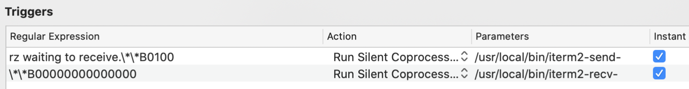

# 前言

2014年中期的15寸MacPro，闲置已久，偶尔用来上下网。

根据[官方说明](https://support.apple.com/zh-cn/111980)，可以支持到Big Sur版本（MacOS 11），过去尝试升级到此版本，并没有成功。

最近拿出两天时间(2025/03/05-03/06)尝试进行系统升级。

# 为什么进行升级

当前版本Sierra 10.12.6存在的问题：

- Chrome版本最高只能到90，很多插件已经不再支持这个版本。
-  科学上网全局代理客户端（e.g. ClashX），已经不支持这个版本。导致一些功能（比如Google全页翻译，Homebrew安装软件）用不了。
- 其他很多软件在低版本运行，新特性无法使用。

# 升级准备

- 启动U盘2个。

  1个8G（Yosemite 10 bootable installer），这个U盘是过去制作的，因为当时通过互联网下载安装，一直失败，于是制作了这个启动盘并一直保存。

  制作方法参考这个网址，[Create a bootable installer for macOS](https://support.apple.com/en-us/101578)。也可以用下面提到的[Open Core Legacy Patcher](https://dortania.github.io/OpenCore-Legacy-Patcher/)进行制作。

  1个32G（Monterey 12 bootable installer），用[Open Core Legacy Patcher](https://dortania.github.io/OpenCore-Legacy-Patcher/)进行制作。操作过程中，这个U盘制作了11-15的所有启动安装盘，最终用了Monterey12。

- 移动硬盘1个，重装之前使用Time Machine进行备份。开辟1个100G分区，存储官网下载的10.12.6/11/12/13/14/15 PKG文件（PKG文件会在制作bootable installer时用到）。

# 安装系统

- 用8G U盘（Yosemite 10.10.5 bootable installer），安装系统。

  这个MacOS 10也是这个机器的最初版本。安装过程很顺利。

- [官网](https://support.apple.com/en-us/102662)下载并升级到Sierra 10.12.6，直接安装PKG到/Applications下进行安装即可，这个过程也很顺利。

- 使用[Open Core Legacy Patcher](https://dortania.github.io/OpenCore-Legacy-Patcher/)制作Monterey 12 bootable installer。

  制作方法参考：[Install macOS on Unsupported Macs - Catalina/ Big Sur/ Monetery/ Ventura and Sonoma](https://medium.com/future-drafted/install-macos-on-unsupported-macs-catalina-big-sur-monetery-ventura-and-sonoma-a9003cf5ad75)。

# 安装应用

## Alfred/iTerm/Sublime/搜狗输入法/[ClashX](https://clashx.org/)

Google搜索安装即可，smoothly！

## 安装[Home-brew](https://brew.sh/)

- 官网不再技术支持Monterey 12以及通过OpenCore升级的版本。但是依然可以安装最新的4.4.23版本。

- 使用官方提供的bash脚本，是会报一些Connection方面的错误的，需要全局代理。另外，Mac终端默认是不会用代理的，需要在终端执行命令：

  ```
  `export https_proxy=http://127.0.0.1:7890 http_proxy=http://127.0.0.1:7890 all_proxy=socks5://127.0.0.1:7890`
  ```

  也可以把这一行加到~/.bash_profile中。

  这个命令是在通过ClashX的Copy Shell Command拷贝得来。如下：

  

  我执行完这个命令，通过智能选择速度最快的香港代理服务器，依然不能安装，后来通过手工更改VPN为一个美国代理点解决。

- brew 清理缓存

  可以运行 `$ brew cleanup` 来清除缓存文件让它们不再占用你的硬盘空间——然而 `cleanup` 的常规策略是仅清除超过 120天的缓存，而不是“所有”缓存，所以你可能需要使用 `--prune=all` 选项来清除所有缓存：

  ```bash
  brew cleanup --help
  brew cleanup --prune=all
  ```

## 安装Typo

比较好用的所见即所得MarkDown编辑器。

最后一个免费版本是：[0.11.18](https://zahui.fan/posts/64b52e0d/)。官网：[https://typora.io/](https://typora.io/)。

## 配置GitHub

- Git Client

  ```bash
  # 生成sshkey
  ssh-keygen -t ed25519 -C "your_email@example.com"
  # Copies the contents of the id_ed25519.pub file to your clipboard
  $ pbcopy < ~/.ssh/id_ed25519.pub
  ```

- https://github.com/

  [SSH and GPG keys](https://github.com/settings/keys) -> New SSH key -> Copy SSH Key to the key textbook -> Click Add SSH Key button

- Verifying

  ```
  ssh -T git@github.com
  
  > The authenticity of host 'github.com (IP ADDRESS)' can't be established.
  > ED25519 key fingerprint is SHA256:+DiY3wvvV6TuJJhbpZisF/zLDA0zPMSvHdkr4UvCOqU.
  > Are you sure you want to continue connecting (yes/no)?
  ```

  因为之前用http方式pull的，所以现在依然是通过http方式验证。需要更改拉取方式，一下3种方式，任选其一：

  ```
  # 1.修改 git remote origin set-url [url]
  # 2.先删后加 git remote rm origin; git remote add origin [url]
  # 3.直接修改config文件，把项目地址换成新的。vim .git/config
  ```

  Git仓库地址使用SSH方式拉取。

  ```
  git clone git@github.com:pumadong/pumadong.github.io.git
  ```

- 参考：

  [GitHub Docs](https://docs.github.com/en/authentication/connecting-to-github-with-ssh/generating-a-new-ssh-key-and-adding-it-to-the-ssh-agent)

  [GitHub不再支持密码验证解决方案](https://cloud.tencent.com/developer/article/1861466)。

## brew install ruby@3.3

遇到openssl3.4.1因为test通不过停止安装的问题


下载源码自行编译安装可以解决这个问题：

```bash
curl -O https://www.openssl.org/source/openssl-3.4.1.tar.gz

tar xzfv openssl-3.4.1.tar.gz

cd openssl-3.4.1

# 不喜欢用 perl, 直接 ./config 干净利落
./config \
  --prefix=/usr/local/Cellar/openssl@3/3.4.1 \
  --openssldir=/usr/local/openssl@3 \
  --libdir=lib \
  no-ssl3 \
  no-ssl3-method \
  no-zlib \
  darwin64-x86_64-cc \
  enable-ec_nistp_64_gcc_128

make

sudo make install MANDIR=/usr/local/Cellar/openssl@3/3.4.1/share/man MANSUFFIX=ssl
```

新开终端, 验证确认：openssl --version

homebrew 链接 openssl，让 brew 正确识别, 后续安装 python@3.10 分析依赖, 自然就会跳过 openssl@3 安装

```
brew link openssl@3
```

以上解决办法参考这篇文章：[老旧Mac 以 homebrew 安装 openssl@3 失败的问题及解决](https://www.zfkun.com/old-mac-openssl-install.html)。

此外，虽然以上办法安装完成openssl@3，但是遇到了llvm19无法安装的问题，在build的时候过不去。临时放弃3.3这个版本。

## brew install ruby@3.1


安装过程顺利，需要手工把安装路径加到~/.bash_profile中。

安装ruby(>=2.7)的目的是为了安装jekyll，这个blog生成工具可以和github.io很好的配合。

## jekyll

[https://jekyllrb.com/docs/](https://jekyllrb.com/docs/)

### 安装

直接用gem install jekyll后，安装成功，但是找不到位置执行jekyll。

找到这个解决办法：[https://jekyllrb.com/docs/troubleshooting/#installation-problems](https://jekyllrb.com/docs/troubleshooting/#installation-problems)。

```
gem install -n /usr/local/bin jekyll
```

参考[https://jekyllrb.com/docs/](https://jekyllrb.com/docs/)Quickstart测试一下。不错，很顺畅！！！

### 配置、github.io集成

根据官方向导：<https://mmistakes.github.io/minimal-mistakes/docs/quick-start-guide/>，安装jekyll。

```
# Add the following to your Gemfile:
gem "minimal-mistakes-jekyll"
# Fetch and update bundled gems by running the following Bundler command:
bundle
# Set the theme in your project’s Jekyll _config.yml file
theme: minimal-mistakes-jekyll
```

执行：`bundle info --path minimal-mistakes-jekyll`，可以看到模版已经通过gem方式安装成功，显示结果如下：

`/usr/local/lib/ruby/gems/3.1.0/gems/minimal-mistakes-jekyll-4.26.2`

运行一个站点：

```
jekyll new myblog
cd myblog
bundle exec jekyll serve
```

通过：http://localhost:4000/，可以看到模版的展示结果了

根据[Config Guide](https://mmistakes.github.io/minimal-mistakes/docs/configuration/)，通过系统变量、展示布局等参数的更改，定制站点的展示结果。

关于默认字体太大的问题，拷贝assets/css/main.scss，做如下修改。

```
---
# Only the main Sass file needs front matter (the dashes are enough)
search: false
---

@charset "utf-8";

@import "minimal-mistakes/skins/{{ site.minimal_mistakes_skin | default: 'default' }}"; 

@import "minimal-mistakes";

// 增加如下
section {
  aside {
    font-size:22px
  }
  font-size: 16px
}
```

字体问题参考：

[https://github.com/mmistakes/minimal-mistakes/discussions/1352](https://github.com/mmistakes/minimal-mistakes/discussions/1352)

[https://github.com/mmistakes/minimal-mistakes/issues/2290](https://github.com/mmistakes/minimal-mistakes/issues/2290)

[https://github.com/mmistakes/minimal-mistakes/discussions/1219](https://github.com/mmistakes/minimal-mistakes/discussions/1219)

GitHub部署，配置_config.yml和Gemfile这两个文件，

```
# _config.yml

remote_theme: "mmistakes/minimal-mistakes@master"

plugins:
  - jekyll-paginate
  - jekyll-sitemap
  - jekyll-gist
  - jekyll-feed
  - jemoji
  - jekyll-include-cache
```

```
# Gemfile
group :jekyll_plugins do
  gem "jekyll-paginate"
  gem "jekyll-sitemap"
  gem "jekyll-gist"
  gem "jekyll-feed"
  gem "jemoji"
  gem "jekyll-include-cache"
  gem "jekyll-algolia"
end
```

GitHub部署参考：

[https://github.com/mmistakes/minimal-mistakes/issues/1992](https://github.com/mmistakes/minimal-mistakes/issues/1992)

[https://github.com/mmistakes/minimal-mistakes/issues/1875](https://github.com/mmistakes/minimal-mistakes/issues/1875)

[https://github.com/mmistakes/minimal-mistakes/blob/master/docs/_config.yml](https://github.com/mmistakes/minimal-mistakes/blob/master/docs/_config.yml)

[https://github.com/mmistakes/minimal-mistakes/blob/master/docs/Gemfile](https://github.com/mmistakes/minimal-mistakes/blob/master/docs/Gemfile)

_config.yml在本地和远端的配置是不一样的，如果不更改，不希望提交到远端：

```
git update-index --assume-unchanged _config.yml
```

有更改需要提交的时候，做如下更改：

```
git update-index --no-assume-unchanged _config.yml
```

## rzsz

iterm2配置rzsz，档SSH到某个Server后，可以与server通过ZMODEM协议快捷交换文件。

mac下这是最好的rzsz配置方式，putty是不支持ZMODEM协议的，SecureCRT是收费的。

```
# 安装rzsz
brew install lrzsz
# 通过which rz可以看到brew已经帮我们设置好了软连接
lrwxr-xr-x    1 bob   admin    32 Mar 12 01:04 rz -> ../Cellar/lrzsz/0.12.20_1/bin/rz
lrwxr-xr-x    1 bob   admin    32 Mar 12 01:04 sz -> ../Cellar/lrzsz/0.12.20_1/bin/sz
# 如果没有的话，就需要手动做链接
```

将iterm2-send-zmodem.sh和iterm2-recv-zmodem.sh保存到/usr/local/bin目录下。

```
# iterm2-send-zmodem.sh

#!/bin/bash
# Author: Matt Mastracci (matthew@mastracci.com)
# AppleScript from http://stackoverflow.com/questions/4309087/cancel-button-on-osascript-in-a-bash-script
# licensed under cc-wiki with attribution required 
# Remainder of script public domain

osascript -e 'tell application "iTerm2" to version' > /dev/null 2>&1 && NAME=iTerm2 || NAME=iTerm
if [[ $NAME = "iTerm" ]]; then
	FILE=$(osascript -e 'tell application "iTerm" to activate' -e 'tell application "iTerm" to set thefile to choose file with prompt "Choose a file to send"' -e "do shell script (\"echo \"&(quoted form of POSIX path of thefile as Unicode text)&\"\")")
else
	FILE=$(osascript -e 'tell application "iTerm2" to activate' -e 'tell application "iTerm2" to set thefile to choose file with prompt "Choose a file to send"' -e "do shell script (\"echo \"&(quoted form of POSIX path of thefile as Unicode text)&\"\")")
fi
if [[ $FILE = "" ]]; then
	echo Cancelled.
	# Send ZModem cancel
	echo -e \\x18\\x18\\x18\\x18\\x18
	sleep 1
	echo
	echo \# Cancelled transfer
else
	/usr/local/bin/sz "$FILE" --escape --binary --bufsize 4096
	sleep 1
	echo
	echo \# Received "$FILE"
fi
```

```
# iterm2-recv-zmodem.sh

#!/bin/bash
# Author: Matt Mastracci (matthew@mastracci.com)
# AppleScript from http://stackoverflow.com/questions/4309087/cancel-button-on-osascript-in-a-bash-script
# licensed under cc-wiki with attribution required 
# Remainder of script public domain

osascript -e 'tell application "iTerm2" to version' > /dev/null 2>&1 && NAME=iTerm2 || NAME=iTerm
if [[ $NAME = "iTerm" ]]; then
	FILE=$(osascript -e 'tell application "iTerm" to activate' -e 'tell application "iTerm" to set thefile to choose folder with prompt "Choose a folder to place received files in"' -e "do shell script (\"echo \"&(quoted form of POSIX path of thefile as Unicode text)&\"\")")
else
	FILE=$(osascript -e 'tell application "iTerm2" to activate' -e 'tell application "iTerm2" to set thefile to choose folder with prompt "Choose a folder to place received files in"' -e "do shell script (\"echo \"&(quoted form of POSIX path of thefile as Unicode text)&\"\")")
fi

if [[ $FILE = "" ]]; then
	echo Cancelled.
	# Send ZModem cancel
	echo -e \\x18\\x18\\x18\\x18\\x18
	sleep 1
	echo
	echo \# Cancelled transfer
else
	cd "$FILE"
	/usr/local/bin/rz --rename --escape --binary --bufsize 4096 
	sleep 1
	echo
	echo
	echo \# Sent \-\> $FILE
fi
```

```
# 赋予这两个文件可执行权限
chmod 777 /usr/local/bin/iterm2-*
```

置好配置文件之后，开始对iTerm2进行配置

点击 iTerm2 的设置界面 Perference-> Profiles -> Default -> Advanced -> Triggers 的 Edit 按钮，加入以下配置

添加两条trigger，分别设置 Regular expression，Action，Parameters，Instant如下：



```
Regular expression: rz waiting to receive.\*\*B0100
Action: Run Silent Coprocess
Parameters: /usr/local/bin/iterm2-send-zmodem.sh
Instant: checked

Regular expression: \*\*B00000000000000
Action: Run Silent Coprocess
Parameters: /usr/local/bin/iterm2-recv-zmodem.sh
Instant: checked
```

当我们SSH到一个安装了rzsz的server之后，就可以通过在server的命令行输入rzsz来上传和下载文件了。

```
sz用法：

	下载一个文件
	sz filename 

	下载多个文件
	sz filename1 filename2

	下载dir目录下的所有文件，不包含dir下的文件夹
	sz dir/*

rz用法：

	输入rz回车后，会出现文件选择对话框，选择需要上传文件，一次可以指定多个文件，上传到服务器的路径为当前执行rz命令的目录。
```

rz与sz只适合小的文件传输，大文件还是使用Filezilla与xftp等工具进行传输；

只能传输文件，而不能传输文件夹；

不是所有工具都支持rz与sz，必须支持ZModem协议才行，例如putty不能使用rz与sz。

原文链接：<https://wsgzao.github.io/post/lrzsz/>

## brew install java

```
openjdk: A full installation of Xcode.app is required to compile
this software. Installing just the Command Line Tools is not sufficient.

Xcode can be installed from the App Store.
Error: openjdk: An unsatisfied requirement failed this build.
```


## Idea

历史版本：<https://www.jetbrains.com/idea/download/other.html>。

# 待解决问题

- High Sierra 10.13.6这个版本的下载地址非常少。如果从App Store下载，是个Stub版本(只有几十M，不是10多G)，不能用来制作bootable installer，尝试从网上找到的资源，比如[Archive](https://archive.org/details/macOS.High.Sierra.10.13.6)，又Verify失败，所以我就放弃了这个版本。

  当时之所以计划安装这个版本，是想从Sierra 10.12.6直接到Sonoma 14，Open Coare Legacy Patcher提示需要这个版本。后来直接从Sierra到Big Sur，就放弃这个版本了。

- Monterey 12的安装过程，错误日志也提示过no compatibility bundle的问题并安装失败，但是重试了两次，就成功了。

- Ventura 13/Sonoma 14/Sequoia 15，都尝试多次，但是安装失败。

  - 开始安装后，字体马上变得特别小，几乎看不清。

  - 可能和无线WIFI存在某种兼容问题，第一步选择网络时，识别网络并加入成功，后续安装过程中出现WIFI断网（实际WIFI是正常的）。


  - 有错误日志：no compatibility bundle on this version of macos. will assume compatible，然后安装失败。Google了一下，有说Date问题，有说U盘问题。我确认过系统时间，是对的，U盘也多次制作，没有成功。

# 后记

2021年，Big Sur(11)发布的时候，官宣是支持这个机型的，但是安装系统失败并不能启动。

当时需要快速修复并有日常的开发工作，并没有很多时间研究系统问题，于是快速回退到Sierra。

本次用10年前的Mac老本升级到MacOS Monterey(12)，用时约3天。

这期间遇到过操作系统和硬件兼容性问题，科学上网不稳定问题，应用不支持当前OS版本问题，应用软件的配置使用问题。

最终通过Google搜索，尝试，看日志，看代码，把问题一个一个解决！让其重新成为一个稳定运行的系统。