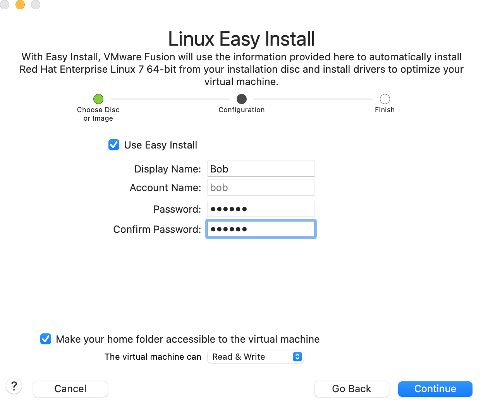
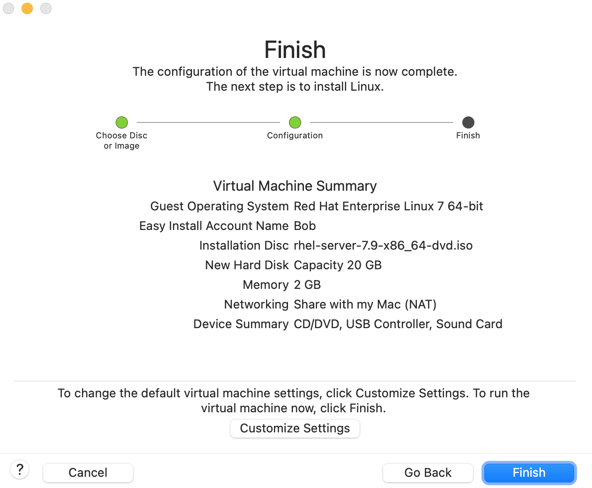

---

layout: single
title: RHEL Server环境搭建
permalink: /os/set-up-rhel-environment.html

classes: wide

author: Bob Dong

---


# 前言

2013年刚刚从.Net转向Java不久，当时写了很多学习记录，本篇链接：[RHEL Server环境搭建](https://blog.csdn.net/puma_dong/article/details/17889593)。

现在是2025年了，重新整理一次，进行一次知识复盘和梳理。

# 安装RHEL虚拟机

1. 安装环境
   MacOS Monterey 12，[Vmware Fusion 13.5.2](https://vmware-fusion.en.uptodown.com/mac/download)，[rhel-server-7.9-x86_64-dvd.iso](https://archive.org/details/rhel-server-7.9-x86_64-dvd)。

2. 安装虚拟机

   

3. Login

   bob/123456

   修改配置权限不足切换到root，su - root。

# 常用配置

## 启动方式

默认已经在命令行界面，graphical.target方式。

vim /etc/inittab 已经失效，提示使用systemctl命令。

```
# 查看当前启动方式
systemctl get-default
```

## 配置IP地址

可以使用图形工具nmtui，修改完成后执行systemctl restart network。

我使用了如下的命令行方式：

- ip addr，找出网卡的名字，比如下面的ens33。

- route -n，找出网卡的当前配置，网关，掩码。

- vim /etc/sysconfig/network-scripts/ifcfg-ens33，修改配置。
  
  ```
  TYPE="Ethernet"
  PROXY_METHOD="none"
  BROWSER_ONLY="no"
  BOOTPROTO="STATIC"	# 修改，原来尾dhcp
  DEFROUTE="yes"
  IPV4_FAILURE_FATAL="no"
  IPADDR0=192.168.197.11	# 新增
  NETMASK0=255.255.255.0	# 新增
  GATEWAY0=192.168.197.2	# 新增
  DNS1=8.8.8.8
  IPV6INIT="yes"
  IPV6_AUTOCONF="yes"
  IPV6_DEFROUTE="yes"
  IPV6_FAILURE_FATAL="no"
  IPV6_ADDR_GEN_MODE="stable-privacy"
  NAME="ens33"
  UUID="faf695c7-9140-4a72-ba33-a607eb33aa7e"
  DEVICE="ens33"
  ONBOOT="yes"
  ```
  
  备注：IPADDR0、NETMASK0和GATEWAY0后面的0代表第一个地址，IPADDR1代表第二个地址，以此类推；DNS是以1为代表第一个地址；后面的数值必须要写，否则配置不生效。
  
- systemctl restart network，使配置生效

- 网络连接方式

  默认是NAT方式，这种方式和宿主机互相访问没有问题，访问外网也没有问题，但是不能被其他机器访问到。

  如果需要被其他机器访问到，需要更改为Bridge访问。如此一来，虚拟机就像局域网一台独立的机器一样。注意，如果宿主机改变网络时，需要更改虚拟机的网络配置。

  我更改为了和我的宿主机一样网段的固定IP(192.168.8.11)：

  ```
  TYPE="Ethernet"
  PROXY_METHOD="none"
  BROWSER_ONLY="no"
  BOOTPROTO="STATIC"
  DEFROUTE="yes"
  IPV4_FAILURE_FATAL="no"
  # IPADDR0=192.168.197.11
  IPADDR0=192.168.8.11
  NETMASK0=255.255.255.0
  # GATEWAY0=192.168.197.2
  GATEWAY0=192.168.8.1
  DNS1=8.8.8.8
  IPV6INIT="yes"
  IPV6_AUTOCONF="yes"
  IPV6_DEFROUTE="yes"
  IPV6_FAILURE_FATAL="no"
  IPV6_ADDR_GEN_MODE="stable-privacy"
  NAME="ens33"
  UUID="faf695c7-9140-4a72-ba33-a607eb33aa7e"
  DEVICE="ens33"
  ONBOOT="yes"
  ```

  参考：<https://www.cnblogs.com/chang09/p/16584045.html>

## 设置时区、时间自动和标准时间同步

- 设置Linux的时区

  查看时区：timedatectl

  设置时区：timedatectl  set-timezone Asia/Shanghai 

- 设置时间自动和标准时间同步

  /etc/chrony.conf，注释默认时间源，增加公共NTP服务器地址。

  ```
  [bob@localhost ~]$ cat /etc/chrony.conf
  # Use public servers from the pool.ntp.org project.
  # Please consider joining the pool (http://www.pool.ntp.org/join.html).
  # server 0.rhel.pool.ntp.org iburst
  # server 1.rhel.pool.ntp.org iburst
  # server 2.rhel.pool.ntp.org iburst
  # server 3.rhel.pool.ntp.org iburst
  server	ntp.ntsc.ac.cn	iburst	# 新增
  ```
  
  常用的公共NTP服务器：<https://dns.icoa.cn/ntp/>
  
  重启服务：systemctl restart chronyd
  
  查看时间源：chronyc sources -v

## 关掉Red Hat Subscription Manager

vim /etc/yum/pluginconf.d/subscription-manager.conf

修改enabled=0，目的是避免使用yum时一直提示注册。

参考：[cnblogs](https://www.cnblogs.com/ajunyu/p/13297449.html)、[serverfault](https://serverfault.com/questions/764900/how-to-remove-this-warning-this-system-is-not-registered-to-red-hat-subscriptio)。

## 防火墙

- 关闭SELinux：
  修改/etc/selinux/config文件中的SELINUX="" 为 disabled ，然后重启。如果不想重启系统，使用命令setenforce 0
  注：
  setenforce 1 设置SELinux 成为enforcing模式
  setenforce 0 设置SELinux 成为permissive模式

- 开启80端口

  ```
    firewall-cmd --zone=public --add-port=80/tcp --permanent
    firewall-cmd --reload
    iptables-save | grep 80
  ```
  看到如下提示，开启成功。
  ```
  -A IN_public_allow -p tcp -m tcp --dport 80 -m conntrack --ctstate NEW -j ACCEPT
  ```

## 安装rzsz，方便Mac/Windows通过ZMODEM协议和虚拟机交换文件

```
 wget https://www.ohse.de/uwe/releases/lrzsz-0.12.20.tar.gz
 tar zxvf lrzsz-0.12.20.tar.gz && cd lrzsz-0.12.20
 ./configure && make && make install
 # 上面安装过程默认把lsz和lrz安装到了/usr/local/bin/目录下，现在我们并不能直接使用
 # 可以把/usr/local/bin加到PATH系统变量，也可以创建软链接，并命名为rz/sz：
 cd /usr/bin
 ln -s /usr/local/bin/lrz rz
 ln -s /usr/local/bin/lsz sz
```

在server安装rzsz完毕后，Windows下通过（putty, SecureCRT），Mac下通过iTerm2，SSH到Server后，就可以在server的命令行窗口输入rzsz，接收和发送文件。

rzsz官网：<https://www.ohse.de/uwe/software/lrzsz.html>

ZMODEM说明：<https://en.wikipedia.org/wiki/ZMODEM>

# Nginx

- wget http://nginx.org/packages/rhel/7/x86_64/RPMS/nginx-1.8.0-1.el7.ngx.x86_64.rpm

  [http://nginx.org/packages/rhel/](http://nginx.org/packages/rhel/)，这是nginx官方下载地址。

- rpm -ivh nginx-release-centos-6-0.el6.ngx.noarch.rpm

  这一步实际是制作了一个yum源，在/etc/yum.repos.d/目录下增加了文件：nginx.repo，内容如下：

  ```
  # nginx.repo
  [nginx]
  name=nginx repo
  baseurl=http://nginx.org/packages/rhel/7/$basearch/
  gpgcheck=0
  enabled=1
  ```

  这个文件也可以手动添加。

- yum install nginx

  关于“libpcre2-8.so.0()(64bit)”的报错，我临时先用--skip-broken的方式解决

- 服务管理

  systemctl enable nginx.service	# 系统启动时Nginx启动

  systemctl start nginx.service	# 启动Nginx服务

  systemctl status nginx.service	# 查看Nginx服务状态

- 由于我们之前开启了80端口，现在在另一台机器可以通过http://192.168.197.11/访问到Nginx的欢迎界面了。

在当前实际的生产中，有很多基于Nginx的二次开发项目，比如：[tengine](https://tengine.taobao.org/)、[OpenResty](https://openresty.org/cn/)，我们在访问各大网站时，可以通过head查看其使用的web server。

```
curl --head www.163.com

HTTP/1.1 301 Moved Permanently
Server: Tengine
Date: Thu, 13 Mar 2025 07:18:22 GMT
Content-Type: text/html
Content-Length: 262
Connection: keep-alive
Location: https://www.163.com/
Cache-Control: no-cache,no-store,private
cdn-user-ip: 60.255.133.141
cdn-source: Ali
cdn-ip: 60.255.162.251
Via: ens-cache6.cn7603[,0]
Timing-Allow-Origin: *
EagleId: 3cffa29a17418503022216274e
```

# Java 17

1. wget https://download.oracle.com/java/17/archive/jdk-17.0.12_linux-x64_bin.rpm

2. yum -y install ./jdk-17.0.12_linux-x64_bin.rpm

3. 安装成功

   ```
   [bob@localhost ~]$ which java
   /usr/bin/java
   [bob@localhost ~]$ ls -al /usr/bin | grep java
   lrwxrwxrwx.  1 root root         22 Mar  8 16:29 java -> /etc/alternatives/java
   lrwxrwxrwx.  1 root root         23 Mar  8 16:29 javac -> /etc/alternatives/javac
   lrwxrwxrwx.  1 root root         25 Mar  8 16:29 javadoc -> /etc/alternatives/javadoc
   lrwxrwxrwx.  1 root root         23 Mar  8 16:29 javap -> /etc/alternatives/javap
   [bob@localhost ~]$ java --version
   java 17.0.12 2024-07-16 LTS
   Java(TM) SE Runtime Environment (build 17.0.12+8-LTS-286)
   Java HotSpot(TM) 64-Bit Server VM (build 17.0.12+8-LTS-286, mixed mode, sharing)
   ```
   
   可以继续配置JAVA_HOME，JRE_HOME，CLASSPATH能环境变量，以备安装其他应用时使用。

# 服务治理

- 2013年的情况

  Dubbo官网：[https://dubbo.apache.org/zh-cn/overview/what/overview/](https://dubbo.apache.org/zh-cn/overview/what/overview/)

  在2012/2013年的时候，Dubbo是一个阿里开源的，使用非常广泛的服务治理框架。

  届时RPC框架并不多，Facebook的Thrift，Google的ProtoBuf，基本是当时的全部了。

- 头部互联网公司自研

  对于头部公司，会有一些个性化需求，同时需要与公司的其他IT基础设施一起协作，加上人才储备充足，有进行服务治理框架的自研发。

  比如美团的OCTO：[微服务通信框架及治理体系OCTO](https://tech.meituan.com/2019/08/08/large-scale-microservice-communication-framework.html)、[OCTO 2.0](https://tech.meituan.com/2019/12/12/meituan-octo.html)。

- 专业软件厂商的产品

  - Spring Cloud
  - 这里有一个写Spring背后公司故事的文章，很有意思。[Link](https://www.cnblogs.com/ityouknow/p/10213304.html)。

- 行业大佬的文章：[解读微服务的 2022](https://www.infoq.cn/article/wyornavvyp2i4gjy9aoc)。

# 消息队列

- 核心的业务系统，比如订单，用RabitMq较多，因为其高可用性。
- 海量数据的消息，比如日志系统，用Kafka较多，因为其高吞吐量。

# 缓存

- Redis
- Tair

# Maven仓库管理器

https://help.sonatype.com/en/sonatype-nexus-repository.html

# 数据存储

- MySQL
- TiDB
- Hive

# 运维监控

- Open-Falcon
- Nagios
- Zabbix

# 总结


# 后记

本篇是偏向于运维范畴，开发人员熟悉也很有裨益，特别是在中小公司。头部公司的运维相对自动化很多，开发主要精力集中于业务/系统开发即可。

不管是大中小公司，开发也经常会有一些安装、发版工作要做，也时不时地会和运维同事一起查找问题，所以需要对系统环境的了解。