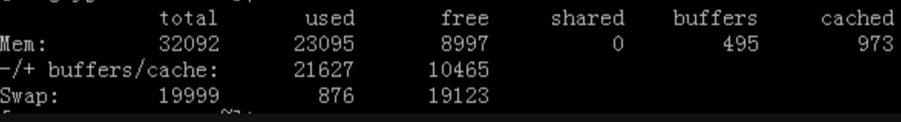
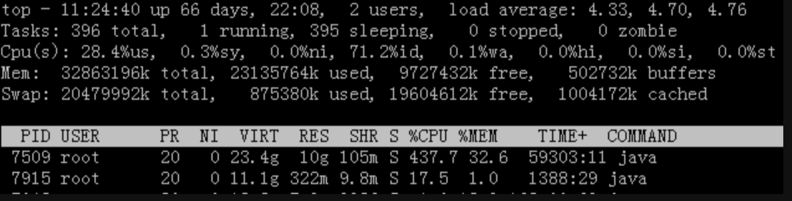

---

layout: single
title: RHEL运维的常用命令、脚本及性能分析
permalink: /os/the-common-rhel-command.html

classes: wide

author: Bob Dong

---

# 前言

在中小公司使用Linux命令较多；

在头部公司用命令的场景主要是定位问题，查看日志，其IT基础设施完善，大多都是通过Web界面进行管理配置，并自动化运行。研发人员主要精力可以专注于业务研发。

这篇文章整理于2013年，当时的原始链接：[Link](https://blog.csdn.net/puma_dong/article/details/16843069)，记录的是中小IT公司的做事方法。

# 常用Linux命令

## OS

- 查看当前linux的版本：

  ```
  more /etc/redhat-release 
  cat /etc/redhat-release
  ```

- 查看内核版本：

  ```
  cat /proc/version
  uname -r 
  uname -a 
  ```

- 查看命令版本：

  ```
  file /bin/bash
  file /bin/cat
  ```

- 查看默认语言：

  ```
  echo $LANG 
  ```

- 查看环境变量

  ```
  echo $PATH
  echo $JAVA_HOME
  ```

- 查看selinux情况：

  ```
  sestatus 
  sestatus | cut -f2 -d:
  cat /etc/sysconfig/selinux
  ```

- 查看时间：

  ```
  date 当前时间 
  uptime 运行时间
  ```

- 查看cron：

  ```
  crontab -l 查看当前用户的
  crontab -u username -l  显示某个用户的
  crontab -e 修改crontab，改后直接生效
  awk 'BEGIN{FS=":"}{print $1}' /etc/passwd | xargs -i crontab -u {} -l 2>/dev/null  查看所有用户的
  ```

- 切换root：

  ```
  sudo su - 切换到root用户，会把当前用户的环境变量带过去
  sudo su 切换到root
  有时我们执行sudo java -version，报错“bash: java: command not found”，是因为root账户并没有把java加入环境变量。
  ```

- 查看当前正在运行的shell

  ```
  # 一个名为 "$$" 的特殊参数 表示当前你正在运行的shell实例的 PID。此参数是只读的，不能被修改。
  Bobs-MacBook-Pro:pumadong.github.io bob$ ps -p $$
    PID TTY           TIME CMD
   1326 ttys001    0:00.07 -bash
  # 使用特殊参数 “$0” ，它表示当前正在运行的shell的名称
  Bobs-MacBook-Pro:pumadong.github.io bob$ echo $0
  -bash
  ```
  
  查看默认shell（不一定是当前正在运行的shell）：
  
  ```
  echo $SHELL
  grep root /etc/passwd	# 查看root用户的默认shell
  ```
  
- 查看当前用户的历史命令：

  ```
  history
  export HISTTIMEFORMAT="`whoami` : |  %F  | %T: | "     加上这个环境变量，可以显示操作人和日期时间。
  ```


- 查看主机:

  ```
  hostname
  cat /etc/hosts
  ```

- 查看安装的软件包

  ```
  rpm -qa
  rpm -qa | wc -l
  yum list installed | wc -l
  ```

## 硬件


- 查看CPU

  ```
  grep 'model name' /proc/cpuinfo | wc -l
  more /proc/cpuinfo | grep "model name"
  grep "model name" /proc/cpuinfo
  grep "model name" /proc/cpuinfo | cut -f2 -d: 
  查看CPU是32位还是64位：getconf LONG_BIT
  ```

- 查看内存

  ```
  grep MemTotal /proc/meminfo
  grep MemTotal /proc/meminfo | cut -f2 -d:
  free -m |grep "Mem" | awk '{print $2}'
  ```

- 查看硬盘和分区

  ```
  df -h
  fdisk -l
  du -sh  可以看到当前目录的大小
  du -sh /etc 可以看到给定目录的大小
  ```

- 重启

  ```
  reboot ，shutdown -r now 立刻重启(root用户使用)  
  shutdown -r 10 过10分钟自动重启 
  shutdown -r 20:35 在时间为20:35时候重启
  ```

- 关机

  ```
  halt ，poweroff  立刻关机  
  shutdown -h now 立刻关机(root用户使用)  
  shutdown -h 10 10分钟后自动关机 
  ```

## 网络

- IP/网关

  ```
  cat /etc/sysconfig/network-scripts/ifcfg-eth0	# eth0 是网卡的名字，可以通过ip addr找到
  cat /etc/sysconfig/network-scripts/ifcfg-eth0 | grep IPADDR
  cat /etc/sysconfig/network-scripts/ifcfg-eth0 | grep IPADDR | cut -f2 -d=
  ifconfig eth0
  ```

- DNS

  ```
  cat /etc/resolv.conf
  ```

## 文件操作

- 移动拷贝

  ```
  mv 移动目录
  cp 拷贝文件 -r递归拷贝
  rm 删除文件
  ```

- 压缩解压

  ```
  tar xzf解压
  tar -cvf /tmp/etc.tar /etc # 仅打包，不压缩！
  tar -zcvf /tmp/etc.tar.gz /etc # 打包后，以 gzip 压缩
  ```

- 建立文件链接

  ```
  ln 建立链接命令，比如：ln -s /usr/jdk1.7.0_45/bin/java /usr/bin/java
  ```

- touch

  ```
  touch # 更新文件的时间戳，比如/etc/rc.d/rc.local中有内容：touch /var/lock/subsys/local 就是代表执行过了的意思
  ```

- 文件定位（whereis/find）

  ```
  which # 根据path查询，所以一般用来查询命令；
  whereis	# 根据linux的文件系统数据库查询，所以可能不是最新的，linux的文件数据库系统一般是一天更新一次；
  ```

  find，是直接搜索磁盘，功能强劲，但是速度不如以上两种

  ```
  find . -type f -mtime 4  代表 4天之前的“一天之内”被更改过的文件
  find . -type f -mtime +4  代表 4天之前（不含4天本身）被更改过的文件
  find . -type f -mtime -4 代表4天之内（含4天之内）被更改过的文件
  find 。 -type f -name "rabbitmq*"	# 查找当前目录下，文件名以rabbitmq开头的文件列表
  find . -type f | grep -l "10.10.20.90"	# 查找当前目录下包含10.10.20.90的所有文
  find . -type f -name "*.*" | xargs grep -rnl  "Hello" # 查找当前目录含有Hello字符串的所有文件，r递归，n显示行号，l只显示文件名
  find / -name access.log 2>/dev/null	# 在根目录下查找所有的access.log，包括子文件夹，遇到没有权限访问等错误，不会显示
  ```

- 文件内容查找（grep/tail/head）

  grep：

  ```
  grep -rnc "字符串" 目录或文件	# 在给定目录或文件中查找字符串出现次数  r是递归，n是显示行号，c是显示次数
  grep -C 5 foo file  显示file文件中匹配foo字串那行以及上下5行
  grep -B 5 foo file  显示foo及前5行
  grep -A 5 foo file  显示foo及后5行
  ```

  ```
  man command | col -b >/home/command.txt 输出命令到文件
  ```

  tail/head：

  ```
  cat filename | tail -n +3000 | head -n 1000   # 从第3000行开始，显示1000行。即显示3000~3999行
  cat filename| head -n 3000 | tail -n +1000  # 显示1000行到3000行
  
  注意两种方法的顺序：
  tail -n 1000/-1000	# 显示最后1000行
  tail -n +1000	# 显示从前面计算，1000行（含）以后的
  head -n 1000/+1000	# 显示前面1000行
  head -n -1000	# 显示从后面计算，1000行（不含）之前的
  ```

- 文件内容替换（sed）

  ```
  sed -i 's/aa/bb/g' *.txt   把当前目录下的所有txt文件中的aa替换成bb
  sed -i 's/http:\/\/www.sina.com.cn//g' *  把当前目录下所有文件的http://www.sina.com.cn替换成空字符
  sed -n '5,10p' filename 只查看文件的第5行到第10行
  ```

  sed wiki地址：http://en.wikipedia.org/wiki/Sed

# 性能分析

## 查看进程

```
ps -ef | grep 'xx' 查看xx进程的id，第二列是PID，第三列是PPID
cd /proc/PID
ll -s
cwd，是你要查找的进程所在路径
jps 查看java进程
```

## 找出问题线程对应的操作

```
ps -ef | grep 'xx # 找出进程pid，比如 30420
top -H -p 30420 # top，然后shift+H可以看出哪个线程pid占用CPU最多，将这个pid转换为16进制，如 44bf，注意要小写
jstack -l -F 30420 > 169.txt # 然后查找 nid=0x44bf字符串
```

```
"main" prio=10 tid=0x0000000053911400 nid=0x44bf runnable [0x0000000040f5c000..0x0000000040f5ced0]    
   java.lang.Thread.State: RUNNABLE    
        at java.net.SocketInputStream.socketRead0(Native Method)    
        at java.net.SocketInputStream.read(SocketInputStream.java:129)    
        at java.net.SocketInputStream.read(SocketInputStream.java:182)    
        at com.caucho.server.resin.Resin.waitForExit(Resin.java:524)    
        at com.caucho.server.resin.Resin.main(Resin.java:614)  
```

参考：

[linux查看占用CPU最多的线程](http://blog.csdn.net/jiafu1115/article/details/7355628)

[Linux下如何查看高CPU占用率线程 LINUX CPU利用率计算](http://san-yun.iteye.com/blog/1568981)

## free -m



**第一行（Mem)的意义，是从操作系统角度来统计的，如下：**

total：物理内存，32092；

used：已用内存（包含buffers和cached），可能部分缓存并未被实际使用，23095

shared：共享内存，一般系统不会用到，0

buffers：系统分配但未被使用的buffers 数量，495

cached：系统分配但未被使用的cache 数量，973，**如果 cache 的值很大，说明cache住的文件数很多。**

关于buffer/cache，历史上曾经是作为读缓存和写缓存，后来演化为页缓存和块缓存。参考：[Page Cache And Buffer Cache](https://www.cnblogs.com/Courage129/p/14311675.html)。

**第二行（-/+ buffers/cache）的意义，是从应用程序角度来统计的，如下：**

used：实际使用的内存总量，等于第一行中的：used - buffers - cached，21627

free：未被使用的buffers /cached 和未被分配的内存之和，这就是系统当前实际可用内存，等于第一行中的：free + buffers + cached，10465

对应用程序来讲，buffer/cached是为了提高程序执行的性能，是同等重要的。当程序使用内存时，buffer/cached会很快地被使用。

所以，从应用视角来看，主要看(-/+ buffers/cached的)的free和used即可。

**第三行（Swap）的意义：表示硬盘上交换分区的使用情况，这里我们不去关心。**


**案例：**

一个Hadoop Master机器，机器内存64G，cached占用40G，应该是大量读取文件造成的

看了另一个生产中的Hadoop Master，机器内存18G，cached也是占用了12G。

网上也说：因为LINUX的内核机制，一般情况下不需要特意去释放已经使用的cache。这些cache起来的内容可以增加文件的读写速度。

据说可以手动释放，但是没有去尝试：echo 3 > /proc/sys/vm/drop_caches

**参考文章：**

<http://blog.csdn.net/blade2001/article/details/8990571>

**备注：**

在RHEL 7及以后版本，free -m 不再区分Buffer/Cached，它们变成了一列。

## top

top命令是Linux下常用的性能分析工具，能够实时显示系统中各个进程的资源占用状况，类似于Windows的任务管理器，截图如下：



前五行是系统整体的统计信息。

- 第一行是任务队列信息，同 uptime 命令的执行结果。其内容如下：

  - 11:24:40： 当前时间

  - up 66 days, 22:08： 系统运行时间

  - 2 user： 当前登录用户数

  - load average: 0.06, 0.60, 0.48：系统负载，即任务队列的平均长度。三个数值分别为 1分钟、5分钟、15分钟前到现在的平均值。

    load average进一步了解：<http://heipark.iteye.com/blog/1340384>

- 第二、三行为进程和CPU的信息。其内容如下：

  - Tasks: 396 total：进程总数

  - 1 running ：正在运行的进程数

  - 395 sleeping ：睡眠的进程数

  - 0 stopped：停止的进程数

  - 0 zombie：僵尸进程数

  - Cpu(s): 28.4% us：用户空间占用CPU百分比

  - 0.3% sy：内核空间占用CPU百分比

  - 0.0% ni：用户进程空间内改变过优先级的进程占用CPU百分比

  - 71.2% id：空闲CPU百分比

  - 0.0% wa：等待输入输出的CPU时间百分比

- 第4行是内存，第5行是交换区。

- 第6行之下是进程信息区。

  - PID：进程ID
  - USER：进程所有者的用户名
  - PR：优先级
  - NI：nice值。负值表示高优先级，正值表示低优先级
  - VIRT：进程申请的虚拟内存总量，单位kb。VIRT=SWAP+RES
  - RES：进程使用的内存大小，单位kb。RES=CODE+DATA
  - SHR：共享内存大小，单位kb
  - S：进程状态。D=不可中断的睡眠状态，R=运行，S=睡眠，T=跟踪/停止，Z=僵尸进程
  - %CPU：上次更新到现在的CPU时间占用百分比
  - %MEM：进程使用的物理内存百分比
  - TIME+：进程使用的CPU时间总计，单位1/100秒
  - COMMAND：进程执行的命令

  - 关于VIRT、RES、SHR，参见这里：<http://www.cnblogs.com/qq78292959/archive/2013/01/23/2873367.html>

- 在top模式下：

  - 输入1，看所有的cpu的使用情况
  - 输入shift+h，看线程
  - 输入f，可以看每个缩写代表的意义
  - 输入c，切换显示命令行和完整命令行信息等等
  - 详解请参考网址：<http://www.cnblogs.com/wangkangluo1/archive/2012/04/18/2454993.html>


## Top Ten

- 查看占用CPU最高的进程TOP 10

  ```
  ps aux|grep -v PID|sort -rn -k +3|head
  ```

- 查看占用内存最高的进程TOP 10

  ```
  ps aux|grep -v PID|sort -rn -k +4|head
  ```

- 查看占用CPU最多的线程

  ```
  #!/bin/bash
  # @Function
  # Find the High cpu consume thread of java, and print the stack of these threads.
  #
  # @Usage
  #   $ ./show-busy-java-threads.sh
  #
  # @author Jerry Lee
  
  redEcho()
  {
      echo -e "\033[1;31m$@\033[0m"
  }
  
  uuid=`date +%s`_${RANDOM}_$$
  
  ps -Leo pid,lwp,user,comm,pcpu --no-headers `jps -lvm | grep hotel | awk -F " " '{print $1}'`  |
  sort -k5 -r -n | head -5 | while read threadLine ; do
          pid=`echo ${threadLine} | awk '{print $1}'`
          threadId=`echo ${threadLine} | awk '{print $2}'`
          threadId0x=`printf %x ${threadId}`
          user=`echo ${threadLine} | awk '{print $3}'`
          pcpu=`echo ${threadLine} | awk '{print $5}'`
  
          jstackFile=/tmp/${uuid}_${pid}
  
          [ ! -f "${jstackFile}" ] &&
          {
              jstack ${pid} > ${jstackFile} ||
              { redEcho "Fail to jstack java process ${pid}"; rm ${jstackFile} ; continue; }
          }
  
          redEcho "The stack of busy(${pcpu}%) thread(${threadId}/0x${threadId0x}) of java process(${pid}) of user(${user}):"
          sed "/nid=0x${threadId0x}/,/^$/p" -n ${jstackFile}
  done
  
  rm /tmp/${uuid}_*
  ```

## 网络状态（netstat）

有个案例，使用F5做负载，每个机器的CPU负载非常不均衡，可以使用netstat查看一下端口的连接数，看看是不是f5的问题。

统计80端口Socket连接数命令：

```
netstat -an | grep 80
netstat -napo | grep -i "80" | wc -l
```

查看连接某服务端口最多的的IP地址：

```
netstat -nat | grep "192.168.8.11:80" |awk '{print $5}'|awk -F: '{print $1}'|sort -nr|uniq -c|head -20
```

TCP各种状态列表：

```
netstat -nat |awk '{print $6}'|sort -nr|uniq -c
```


另外一个案例，[TcpListenOverFlows报警](/case/tcp-listen-over-flows.html)。

```
watch “netstat -s	grep listen”
```

会看到“xxx times the listen queue of a socket overflowed”，并且这个xxx在不断增加，这个xxx就是我们没有对网络请求正常处理的次数。

tcp listen queue: <https://www.douban.com/note/178129553/?_i=1849434-dD0sPF>

## Java程序本身引起的负载问题

对于怀疑Java程序本身引起的负载问题，可以使用jstack等工具看看。


查看这里：[内存性能分析与故障处理工具](/java/deep-in-jvm-diary.html#内存性能分析与故障处理工具)

# 常用批处理文件

## package.sh 用于maven打包

```bash
mvn clean package -Dmaven.test.skip=true  -U
```

## start.sh 用于重启JBOSS

```
killall -9 tail
killall -9 java
source /etc/profile
rm -rf  /usr/java/jboss-eap-5.1/jboss-as/server/default/data/*
rm -rf  /usr/java/jboss-eap-5.1/jboss-as/server/default/tmp/*
rm -rf  /usr/java/jboss-eap-5.1/jboss-as/server/default/work/*
cd $JBOSS_HOME/bin/
nohup $JBOSS_HOME/bin/run.sh -c default -b 0.0.0.0 &
sleep 1
tailf /data/applogs/jbosslogs/server.log
```

## seelog.sh 用于查看日志

```
tailf /data/applogs/jbosslogs/server.log
```

## 执行一个java程序（包含lib下面的jar）

```
#!/usr/bin/env bash
CLASSPATH=.
for f in lib/*.jar; do
CLASSPATH=${CLASSPATH}:$f;
done
nohup java -classpath $CLASSPATH:xx.jar -Xms128m -Xmx1024m xx.xx.xx >> index_logs.txt 2>&1 &
```

关于2>&1的解释：<https://segmentfault.com/a/1190000040086046>。

如下的写法，更完善一些：

```
work_path=/usr/local/workdir
tmp_file=/usr/local/workdir/tmp.txt
work_log=/data/applogs/xx.log
  
export JAVA_HOME=/usr/java/jdk1.6.0_26
export CLASSPATH=.:$JAVA_HOME/jre/lib/rt.jar:$JAVA_HOME/lib/dt.jar:$JAVA_HOME/lib/tools.jar
export PATH=$PATH:$JAVA_HOME/bin
  
export LC_ALL=zh_CN.UTF-8
  
date >> "$work_log"
if [ -f "$tmp_file" ]; then
echo '系统正在运行，尚未完成' >> "$work_log"
echo '' >> "$work_log"
else
echo '系统开始运行 ' >> "$work_log"
echo '' >> "$work_log"
touch "$tmp_file"
cd "$work_path"
  
CLASSPATH=.
for f in ./*.jar; do
CLASSPATH=${CLASSPATH}:$f;
done
  
for f in lib/*.jar; do
CLASSPATH=${CLASSPATH}:$f;
done
echo '计算任务开始运行......' >> "$work_log"
echo '' >> "$work_log"
java -Xms1024m -Xmx12288m -classpath $CLASSPATH com.xx.xx.xx >> "$work_log"
sleep 10
rm "$tmp_file"
echo '计算任务运行完毕' >> "$work_log"
echo '' >> "$work_log"
fi
```
可以把以上存储为一个sh文件，然后用crontab定时运行：5 * * * * /usr/local/workdir/xx.sh &，这是每小时的第5分钟开始执行。

## 定时备份/压缩/清理Tomcat日志

- 修改catalina.sh，设置catalina.out输出目录

```bash
if [ -z "$CATALINA_OUT" ] ; then
  #CATALINA_OUT="$CATALINA_BASE"/logs/catalina.out
  CATALINA_OUT=/data/applogs/tomcatlogs/catalina.out
fi
```

- 00 1  */1 * * /data/sh/find_catalina.sh

```bash
log_path1="/usr/local/apache-tomcat-6.0.35/logs"
log_path2="/usr/local/apache-tomcat-7.0.41/logs/"
log_name="catalina.201*"

find $log_path1 -mmin +60 -name $log_name -exec mv {} /data/applogs/tomcatlogs/tomcat6/ \;
find $log_path2 -mmin +60 -name $log_name -exec mv {} /data/applogs/tomcatlogs/tomcat7/ \;
gzip /data/applogs/tomcatlogs/tomcat6/*.log
gzip /data/applogs/tomcatlogs/tomcat7/*.log
```

- 10 * * * * /data/applogs/clear_tomcat_catalina.sh &

```bash
#!/bin/bash
cd /data/applogs/tomcatlogs
>catalina.out
```

- crontab示例

```bash
5 1 * * * nohup /home/hadoop/jobs/ip/job.sh >> /home/hadoop/jobs/ip/nohup.out 2>&1 &
```

- find命令

压缩2天（含）之前的，清理20天（含）之前的：

```bash
#!/bin/bash
rootpath='/xx/xx';
find $rootpath -mtime +1 -exec /bin/gzip {} \;
find $rootpath -mtime +19 -exec rm -fr {} \;
```

# 开机自动启动设置
## vim /etc/rc.d/rc.local

```bash
#!/bin/sh

#This script will be executed *after* all the other init scripts.
#You can put your own initialization stuff in here if you don't
#want to do the full Sys V style init stuff.
touch /var/lock/subsys/local
/data/sh/route10.50.sh
/usr/local/nagios/bin/nrpe -c /usr/local/nagios/etc/nrpe.cfg -d
/usr/local/zabbix/sbin/zabbix_agentd
/usr/local/nginx/sbin/nginx
/data/sh/restartserverlist
```

把要启动的命令加在这个文件里面，或者自己做一个启动表/data/sh/restartserverlist ，加到这个启动列表里面就行。

## vim /data/sh/restartserverlist

```
/data/ruby/ruby_start
```

## vim /data/sh/rsync_162.sh

```
rsync -avzP --password-file=/etc/sery.pass --delete /data/wcc/ username@10.10.10.162::wcc
```

## vim /data/sh/synctime.sh

```
/usr/sbin/ntpdate 66.187.233.4
/sbin/clock -w
```

# 更新War包到测试/生成环境

一般来说，测试会有一台专门的、干净的机器，用于打包，及将打好的包拷贝到测试环境、生产环境。

**步骤大致如下：**

1. 登录 打包机器
2. cd 代码位置
3. 更新代码：svn up
4. 打包：mvn clean package -Dmaven.test.skip=true -U   或  ./package.sh
5. 传包：scp war包  root@目标机器:目标文件位置
6. 登录测试环境、生产环境
7. 启动：./start.sh
8. 查看日志：./seelog.sh

# 后记

10多年过去了，作为Server运行的Linux，大多在RHEL6下的命令在最新版本依然可以使用。

一些公司的Legacy系统，依然运行在RHEL6下。