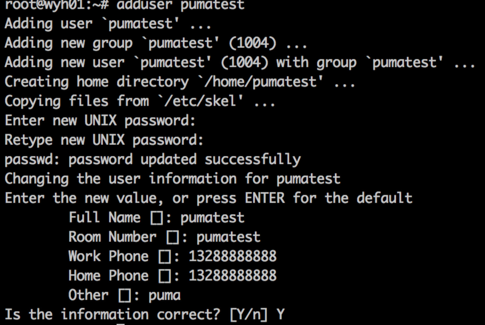
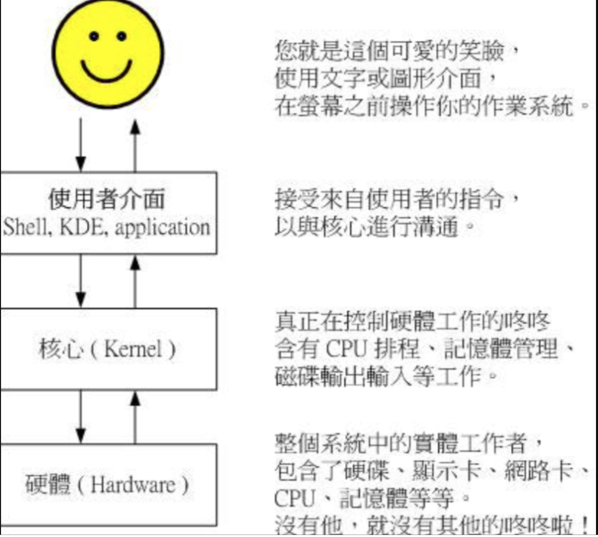
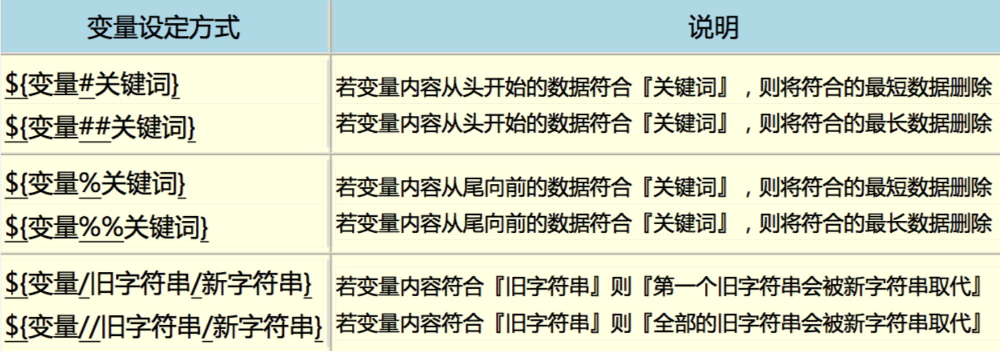
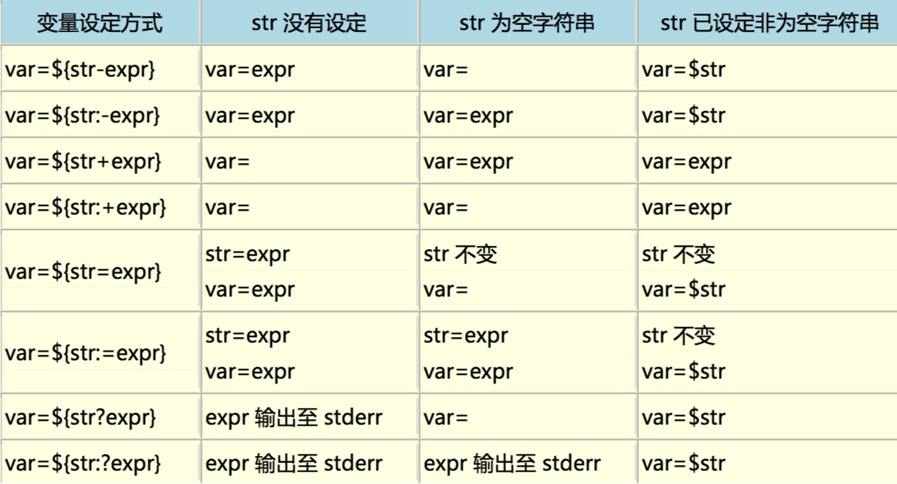
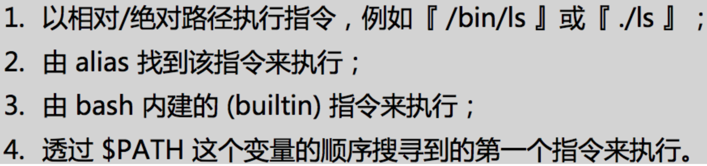
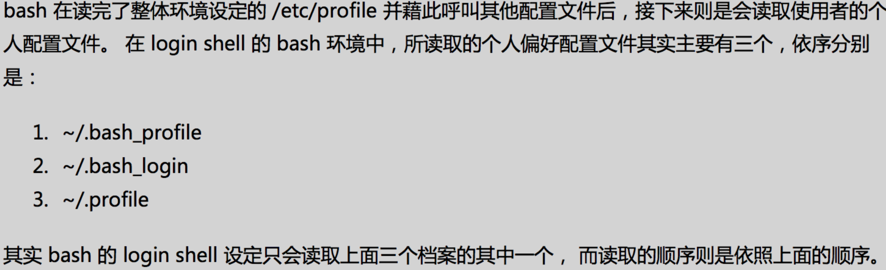
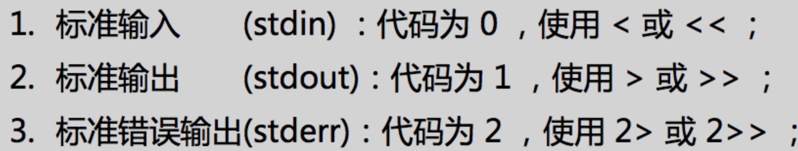
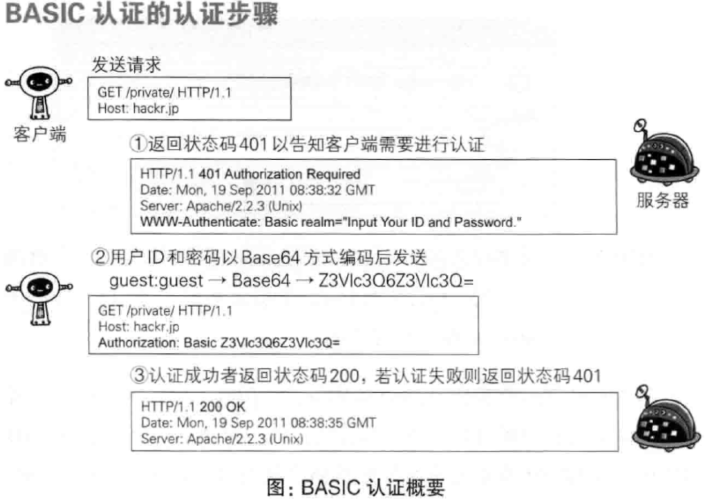
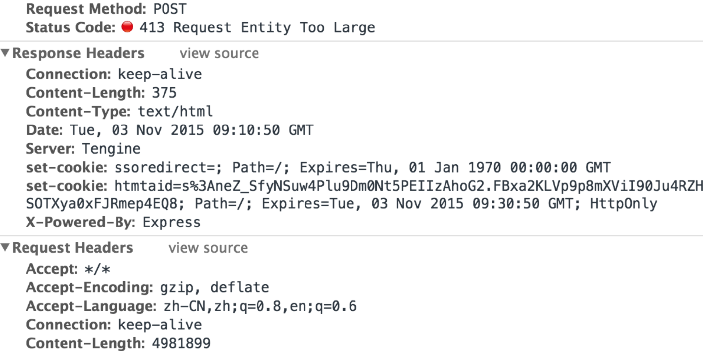

---

layout: single
title: Linux学习-文件权限和账号管理/Bash/Curl&Http
permalink: /os/the-journey-of-linux.html

classes: wide

author: Bob Dong

---

# 前言

2015年学习Linux时写的笔记，原文链接：[1](https://blog.csdn.net/puma_dong/article/details/49435195)，[2](https://blog.csdn.net/puma_dong/article/details/49722141)，[3](https://blog.csdn.net/puma_dong/article/details/49456829)。

Linux是最常用的服务器端操作系统。

在日常工作中，会通过Linux命令排查问题、解决问题；任何语言都要编译成操作系统API。

所以熟悉Linux，对于工作效率提高，深入理解编程语言很有帮助。

# 文件权限和账号管理

## 基本知识

- 用户与用户组

  Linux系统中，默认情况下，账号都是记录在 /etc/passwd 这个文件中；个人密码则是记录在 /etc/shadow 这个文件下；所有的组名都记录在 /etc/group。

- 文件权限的概念

  文件权限，对于用户组的设置，是相当重要的，尤其对于初学者来说。

  因为文件的权限和属性是学习Linux的一个相当重要的关卡，如果没有这部分的概念，那么你很可能老是听不懂别人在讲什么。比如屏幕出现了“Permission deny”，不要担心，肯定是权限设置错误。

- 隐藏文件

  第一个字符为“.”的文件

- 设置权限

  修改 Linux 文件与目录的属性之前，一定要先搞清楚，什么数据是可变的，什么是不可变的。

- 目录与文件的权限意义

  **权限对文件的重要性：**对于文件的rwx，主要都是针对“文件的内容”而言，与文件名的存在与否是没有关系的。因为文件记录的是实际的数据。w是更新文件内容（但不含删除文件）

  **权限对目录的重要性：**

  - r（read contents in directory），w（modify contents of directory），x（access directory）进入目录的权限，作为工作目录。
  - 工作目录对于命令的执行是非常重要的，如果你在某目录下不具有x的权限，那么你就无法切换到该目录下，也就无法执行该目录下的任何命令，即使你具有该目录的r权限。

## 命令

- 改变文件属性与权限的命令

  - chgrp：改变文件所属用户组

  - chown：改变文件所有者，这个命令即可以修改所有者，也可以修改用户组织，完全可以代替chgrp；比如chown owner:group directory

  - chmod：改变文件的权限 ，数字类型改变文件权限（chmod 777 filename），符号类型改变文件权限（chmod u=rwx,go=rx filename、chmod r+x ）

  - chgrp/chown的使用场景：复制行为（cp），会复制执行者的属性和权限，如果复制问题给别人使用，复制完毕后，要修改users/group，以让目标用户可以使用。

- “./run.sh”，这个命令的意义是什么？

  由于命令的执行需要环境变量的支持，若你的执行文件放置在本目录，并且本目录并非正规的执行文件目录（/bin、/usr/bin 等为正规目录），此时要执行命令就得要严格指定该执行文件。

  “./” 代表 “本目录” 的意思，所以 “./run.sh” 代表执行本目录下名为 run.sh 的文件。

- 用户标识符：UID与GID

  账号只是为了人们容易记忆，Linux只会认识ID，而ID与账号的对应关系就在 /etc/passwd当中；组相关的信息在 /etc/group 中； 密码相关的信息在 /etc/shadow 中。

-  用户管理

  - 增加用户

    学习阶段，可以一步一步的加，用户、组、主目录、Shell等；日常应用中用Perl脚本：adduser（/usr/sbin/adduser），截图如下：

    

  - 修改密码

    passwd pumatest

  - 显示用户ID

    id pumatest

  - 删除用户

    userdel pumatest

## 用户身份切换

su是最简单的身份切换命令，它可以进行任何身份的切换，使用总结：

- 若要完整地切换到新用户的环境，必须要使用 “su -username” 或 “su -l username”，才会连同 PATH/USER/MAIL 等变量都转成新用户的环境；

- 如果仅想要执行一次 root 的命令，可以使用“su - -c 命令串” 的方式来处理；

- 使用 root 切换成为任何用户时，并不需要输入新用户的密码。

sudo的执行仅需要自己的密码即可，根据 /etc/sudoers 决定可以执行什么权限，这个文件的配置使用工具 visudo，会有语法检查，使用 visudo ，可以通过用户、用户组、别名等方式进行配置。

sudo的不用输入密码的时间间隔，默认5分钟，也可以在 /etc/sudoers 中设置，不用输入密码。

sudo 和 su 搭配的技巧，sudo su -，不需要root密码，也能切换到root身份。

还有一种配置：sudo -u 某账号 -i 

## 文件和目录操作

常用命令：cd、pwd、mkdir、rmdir、echo、ls、mv、cp、rm

取得路径的文件名与目录名称：basename、dirname

文件内容查询：cat、tac、nl、more、less、head、tail、od、touch

head -n 3 file  头部3行；head -n +3 头部3行；head -n -3 去掉最后3行的所有头部；

tail -n 3 file 末尾3行；tail -n -3 末尾三行；tail -n +3 从头部第三行开始的所有末尾

几个时间的概念：mtime(modification time)、ctime（status)、atime（access）

文件默认权限：umask

查看文件类型：file

文件查询：

which 是根据path查询，所以一般用来查询命令；

whereis 根据linux的文件系统数据库查询，所以可能不是最新的，linux的文件数据库系统一般是一天更新一次；

find 是直接搜索磁盘，功能强劲，但是速度不如以上两种。

find . -type f -mtime 4  代表 4天之前的“一天之内”被更改过的文件

find . -type f -mtime +4  代表 4天之前（不含4天本身）被更改过的文件

find . -type f -mtime -4 代表4天之内（含4天之内）被更改过的文件


# Bash

## Bash 说明

Shell 是操作系统内置的，用于和内核（Kernal）通信，管理硬件的命令行。

内核，是真正在控制硬件工作的，有CPU进程、内存管理、硬盘输入输出等工作，内核是受到保护的，我们只能通过操作系统提供的API来与内核通信。

Shell，KDE，Application等，提供了通过操作系统API与内核通信的能力。

Linux 默认的 Shell 是 Bash，这是在 Sh 这个 Shell 的基础上发展来的。

我们可以通过 /etc/shells 查看 操作系统支持的 Shell 。

用户默认登录取得的 Shell 写在 /etc/passwd 的最后一个字段。


**注意：**

默认shell不一定是当前正在使用的shell，可以通过如下方式查看正在使用的shell：

```
ps -p $$
echo $0
```

## 为什么学习Shell

命令行界面的 Shell 在Linux的各个分发版本都一样；

远程管理时命令行界面速度较快；

Shell 是管理 Linux 系统非常重要的一环，因为 Linux 内很多控制都是以 Shell 编写的。

## 变量

echo：打印变量，例如 echo $HOME

unset：取消变量赋值

set/declare：显示环境变量和用户自定义变量，declare 可以定义变量类型，默认是字符串

declare -x 是定义环境变量，和export 功能一样

env/export：显示环境变量，不显示用户自定义变量；

export 可以把自定义变量变成环境变量

source：读取并执行文件中的命令，常用来加载环境变量；如果以 Shell 命令的方式执行加载环境变量，则只会影响子Shell，不能影响当前 Shell ，所以用source

read：读取键盘输入

$?：显示上一个命令的执行结果，0代表成功，其他数字代表失败

alias：命令别名，比如 ll 就是别名，type ll 可以看到，ll is aliased to `ls -l --color=auto' 

\：转义，比如 \r 回车 \n 换行，在 Shell 输入命令时，可以输入 \回车，就把回车转义了，可以分多行输入命令

'和''：单引号和双引号，变量赋值时，可以用，单引号里面只是纯粹的字符，双引号里面可以保护变量

ulimit：查看修改最大同时打开文件数命令：vim /etc/security/limits.conf 

关于这个值，有些公司这样设置：

```
*                soft    nofile          1000000
*                hard    nofile          1000000
*                soft    core            1048576
*                hard    core            1048576
```

变量内容的删除、替换：是一些需要记忆的符号操作，比如，${变量#关键字}，更多符号：#、##、%、%%、/、//等


变量设定方式：



## 操作环境

- 路径与命令查找顺序

  

- 环境配置文件

  默认系统会有一些环境配置文件的存在，让 bash 在启动时直接读取这些配置文件，以规划好 bash 的工作环境。

  这些配置文件可以分为全体系统的配置文件以及用户个人偏好配置文件。

  全体系统的配置文件：/etc/profile，/etc/profile.d/*.sh 会在这个文件的末尾执行

  用户个人偏好配置文件：
  

## 数据流重定向



2>&1：标准输出和错误输出，都以覆盖的方式进行定位，例如，/bin/bash xx.sh > /dev/null 2>&1

## 管道命令

在每个管道后面接的第一个数据必定是“命令”，而且这个命令必须要能够接受 standard input 的数据才行，这样的命令才可以是“管道命令”，例如less,more,grep,tail，而ls cp mv就不是管道命令，也就是说：

管线命令仅会处理standard output，对于standard error output会予以忽略

管线命令必须要能够接受来自前一个指令的数据成为standard input继续处理才行。

**常用管道命令：**

```
cut：针对行分析，例如 echo $PATH | cut -d ':' -f 3,5  把$PATH 的值，以：为分隔符，取出第3和5列
grep：针对行分析，过滤字符串，常用于文件过大时，不适合用 vim 打开的场景
sort：排序，cat /etc/passwd | sort -t ':' -k 3，用第三列排序
wc：统计，就像SQL中的group
uniq：去重
tee：双向重定向
	last | tee last.list | cut -d ':' -f 1
	$ tee file1 file2	# 在两个文件中复制内容 
tr：字符转换命令
	last | tr '[a-z]' '[A-Z]' 小写换成大写； 
	cat /etc/passwd | tr -d '\r' 将输出信息中的回车去掉
col：经常被用于将 man page 转存为纯文本文件以方便查阅
	man grep | col -b > grep.man
join/paste：文件联合操作
expand：就是将tab转成空格键，比较一下有没有expand的异同即可 grep '^MANPATH' /etc/man.config | head -n 3 | expand -t 6 - | cat -A
split：文件切割命令
-: 一般来说，如果需要 stdout/stdin，但偏偏又没有文件，有的只是一个-，那么这个-就会被当成 stdin 或 stdout
```

# curl和http协议
## curl 说明

curl网站开发指南：<http://www.ruanyifeng.com/blog/2011/09/curl.html>

Http状态码详解：<http://tool.oschina.net/commons?type=5>

cur是强大的，支持多种协议，以http为例，可以模拟多种方式的提交（GET/POST Form/Multipart/Json）。

错误状态

| 错误描述                                                     | 错误原因                                                     |
| ------------------------------------------------------------ | ------------------------------------------------------------ |
| curl: (7) Couldn't connect to server                         | 如果由于本地网络的原因，不能连接外网，则报此错误             |
| curl: (7) Failed to connect to 127.0.0.1 port 8411: Connection refused | 如果应用还没有启动（判断依据：8411端口没有开启监听），则报此错误 |
| Error 503 Service Unavailable                                | 如果应用已经启动（判断依据：8411端口已经开启监听），但是应用不正常，则可能获取到错误信息 |

## http状态码和SpringMVC配置

下面结合服务器端的配置，以及SpringMVC，熟悉一些 curl 命令的使用，及返回错误Http状态码时的场景。

- Spring MVC produces，约定返回格式并和Client的Accept适配

  1. 当不配置produces()属性的时候，会根据客户端Accept请求头来输出响应头的Content-Type

  2. 当配置produces()属性的时候，需要Accept与配置的属性兼容，否则会抛出406或415异常

     当请求头中Accept的value与produces()配置的属性匹配上，则进行映射，否则返回客户端HTTP 406（Not Acceptable）响应，或415 unsupported mediaType

     默认会把produces中配置的内容写到响应头的Content-Type中去

  3. 当配置produces()属性的时候，如果未设置Accept请求头，会根据produces属性来输出响应头的Content-Type

- Spring MVC consumers，约定返回格式并和Client的Accept/ContentType适配

  consumes属性的工作方式类似于produces，不过它会关注请求的ContentType头部信息。

  当请求头中Content-Type的value与consumes()配置的属性匹配上，则进行映射，否则415 unsupported mediaType

- 400

  错误：Error 400 Required String parameter 'test' is not present

  SpringMVC代码：

  ```java
  @ResponseBody
  @RequestMapping(value = "/test/test", method = RequestMethod.POST, produces = "application/json;charset=UTF-8")
  public String test(@RequestParam(value="test", required=false) String test)
  ```

  报错的curl代码：

  ```
  curl -X POST --header "Content-Type:application/json;charset=utf-8" --data test=中国 http://127.0.0.1:8411/test/test.do
  ```

  错误原因：

  客户端请求时定义了“Entity Head Field”， --header "Content-Type:application/json;charset=utf-8"，相当于约定本次请求用json，--data就失效了。

  正确的curl代码：

  ```
  curl -X POST --form test=中国 http://127.0.0.1:8411/test/test.do
  curl -X POST --data test=中国 http://127.0.0.1:8411/test/test.do
  ```

- 401

  Web服务器开启了认证，而客户端没有传入认证信息，或者认证信息错误。

  最基本的是Basic 认证，截个图说明一下吧，如下：

  

  虽然在各种Web服务器（Nginx，IIS等），很容易的配置BA认证，但由于用户名和密码都是作为明文传递的，所以并不安全。

  Amazon的一种认证方法，相比较Basic认证，一样使用简单，但是安全的多，有一些公司在使用，相关文档如下：

  <http://docs.aws.amazon.com/AmazonS3/latest/dev/RESTAuthentication.html>

- 405

  错误：Error 405 Request method 'GET' not supported

  SpringMVC 代码：

  ```
  @ResponseBody
  @RequestMapping(value = "/test/test", method = RequestMethod.POST, produces = "application/json;charset=UTF-8")
  public String test(@RequestParam(value="test", required=false) String test)
  ```

  报错的curl代码：curl -X GET --data test=中国 http://127.0.0.1:8411/test/test.do

  错误原因：Http Method不匹配，服务端支持POST，客户端用GET发起请求

  正确的curl代码：

  ```
  curl -X POST --form test=中国 http://127.0.0.1:8411/test/test.do
  curl -X POST --data test=中国 http://127.0.0.1:8411/test/test.do
  ```

- 406

  错误：Error 406 Not Acceptable

  SpringMVC代码：

  ```
  @ResponseBody
  @RequestMapping(value = "/test/test", method = RequestMethod.POST, produces = "application/json;charset=UTF-8")
  public String test(@RequestBody TestUserInfo userInfo)
  ```

   报错的curl代码：

  ```
  curl -X POST --header "Content-Type:application/json;charset=utf-8" --header "Accept:text/html,application/xhtml+xml,application/xml;q=0.9" -d '{"userId":2}' http://127.0.0.1:8411/test/test.do
  ```

  错误原因：请求Accept和相应的媒体类型不一致

  正确的curl代码：

  ```
  curl -X POST --header "Content-Type:application/json;charset=utf-8" --header "Accept:application/json" -d '{"userId":2}' http://127.0.0.1:8411/test/test.do
  ```

- 413

  多发生在上传文件时，服务器端做了大小限制，比如：

  

- 415

  错误：Error 415 Unsupported Media Type

  SpringMVC代码：

  ```
  @ResponseBody
  @RequestMapping(value = "/test/test", method = RequestMethod.POST, produces = "application/json;charset=UTF-8")
  public String test(@RequestBody TestUserInfo userInfo)
  ```

  错误的curl代码：

  ```
  curl -X POST --header "Accept:text/html,application/xhtml+xml,application/xml;q=0.9" -d '{"userId":2}' http://127.0.0.1:8411/test/test.do
  ```

  错误原因：Accept和produces不匹配。上面的Spring MVC produces部分有详细介绍。

## curl和http小结

通过 curl 的使用，也加深了我们对 http 这种应用层协议的理解。

应用层协议，应用层面的规范，定义一套请求的规范，定义一套响应的规范，由于这是国际标准化组织的定义，以及工业上的广泛应用，造就了其广泛知名度，到达协议的标准。

我们日常工作中，也会定义一些规范；以前工作中也有这种场景，在Soap出来之前，见过牛人用Delphi写的Http通讯程序，也是基于类似xml标签的方式，定义了一套请求和响应的规范，自己进行解析，当Soap出来后，发现很像；这些规范上升不到协议的程度，也是以上的原因。

我们把协议从高大上的位置，拽下来，和我们的日常规范一样的高度，相当于，把抽象的问题形象化，把微观的问题从宏观上来理解，对于协议的入门理解，很有好处。

# 后记

比较长时间没关心这些Linux基础知识了。

上一家公司后期的工作，被项目、需求、会议、Java开发占去了绝大多数的时间。少有专门的成块时间学习。

本次拿出几天时间，把过去写的关于Linux的博客看一遍，发现这些知识依然在头脑中的某个地方，马上就想起来了。

很多知识，已经形成了肌肉记忆：）